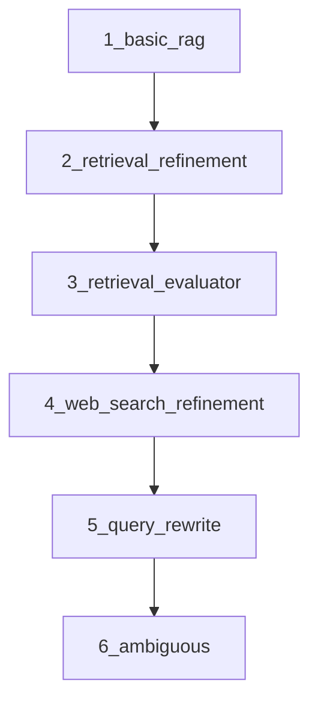
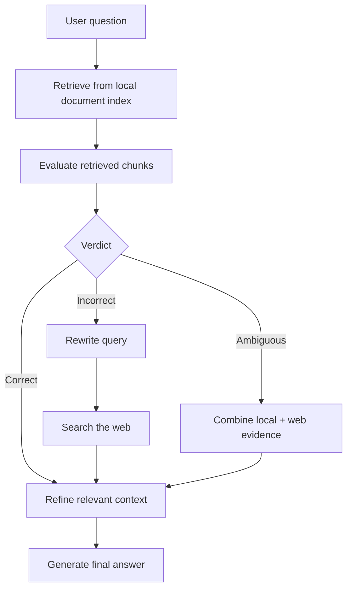

# Corrective RAG: From Naive Retrieval to Smarter, More Reliable Answers

This repository is a hands-on, beginner-friendly walkthrough of Corrective RAG. It starts with a simple Retrieval-Augmented Generation (RAG) system and then gradually improves it with stronger retrieval, refinement, evaluation, web fallback, query rewriting, and ambiguity handling.

If you are new to RAG, think of this repository as a laboratory notebook for building a better assistant. Instead of asking an LLM to answer from memory alone, we first ask it to retrieve relevant evidence from documents, inspect that evidence, decide whether it is good enough, and only then generate an answer.

The core idea is simple:

- retrieve relevant information,
- check whether it is actually useful,
- correct weak retrieval before answering,
- and avoid confidently answering from bad context.

That is the essence of Corrective RAG.

---

## Why this repository exists

Many beginner RAG tutorials stop at a basic pattern:

1. Load documents.
2. Split them into chunks.
3. Create embeddings.
4. Retrieve similar chunks.
5. Send those chunks to an LLM.

That pattern works, but it has weaknesses:

- retrieved chunks can be only loosely related,
- the model can be misled by noisy context,
- weak retrieval can still produce confident but wrong answers,
- and some questions need external knowledge, not just local documents.

This repository teaches how to move from a naive pipeline to a more robust one.

It does that in small, progressive steps:

- start with a basic RAG pipeline,
- add refinement to filter irrelevant sentences,
- add evaluation to judge retrieved chunks,
- add web search for failures,
- add query rewriting for better search,
- and finally handle ambiguous cases more intelligently.

---

## What you will learn

By the end of this repository, you should be able to explain and implement:

- what RAG is and why it exists,
- what a vector database is and how semantic retrieval works,
- how chunking and embeddings help search,
- why retrieval quality matters more than model size in many RAG systems,
- how to refine retrieved context before generation,
- how to evaluate retrieved documents with an LLM judge,
- how to use web search as a fallback source,
- how to rewrite queries for better retrieval,
- and how to design a multi-step reasoning pipeline with LangGraph.

---

## What is RAG?

RAG stands for Retrieval-Augmented Generation.

It is a pattern where a language model does not rely only on its trained memory. Instead, it first retrieves relevant information from an external source such as PDFs, documents, websites, or databases, and then uses that retrieved evidence to generate an answer.

### Intuition

A simple analogy is a student preparing for an exam:

- the model is the student,
- the documents are the textbook,
- and retrieval is the act of opening the right pages.

Without retrieval, the student answers from memory. With retrieval, the student checks the source first.

### Why RAG exists

RAG is useful because it helps LLMs:

- answer using fresh or private information,
- reduce hallucinations,
- cite or ground their answers in evidence,
- and work over large knowledge bases without retraining.

### In this repository

The repository builds a small local document-based RAG system over PDFs. The source documents live in [documents](documents).

---

## What is Corrective RAG?

Corrective RAG is a more careful version of standard RAG.

Instead of blindly trusting the first set of retrieved documents, the system asks:

- Is this retrieval relevant?
- Is it sufficient?
- Is the question ambiguous?
- Should I search the web instead?
- Should I rewrite the question to search better?

This is important because retrieval is often the weakest part of a RAG system. If retrieval fails, generation will often fail too.

### Why it matters

A poor retrieval step can cause:

- irrelevant context,
- noisy context,
- missing evidence,
- or false confidence.

Corrective RAG tries to catch these problems before the final answer is generated.

### Practical intuition

If a search engine returns bad results, a good system does not just accept them. It asks whether the results are good enough, tries another query, or brings in more evidence.

That is exactly what this repository teaches.

---

## Repository structure

The repository is intentionally organized as a learning journey:

- [1_basic_rag.ipynb](1_basic_rag.ipynb) — the simplest end-to-end RAG pipeline
- [2_retrieval_refinement.ipynb](2_retrieval_refinement.ipynb) — refine retrieved context by filtering irrelevant sentences
- [3_retrieval_evaluator.ipynb](3_retrieval_evaluator.ipynb) — evaluate retrieved chunks and route based on quality
- [4_web_search_refinement.ipynb](4_web_search_refinement.ipynb) — add web search as an external fallback
- [5_query_rewrite.ipynb](5_query_rewrite.ipynb) — rewrite the user question into a better search query
- [6_ambiguous.ipynb](6_ambiguous.ipynb) — handle ambiguous queries by combining local and web evidence
- [documents](documents) — source documents used for retrieval

---

## Quick start

### Prerequisites

You will need:

- Python 3.10+
- an OpenAI API key
- a Tavily API key for the web-search notebooks

### Install dependencies

```bash
pip install langchain langchain-community langchain-openai langchain-text-splitters langgraph faiss-cpu pypdf python-dotenv tavily-python
```

### Configure environment variables

Create a .env file in the repository root:

```bash
OPENAI_API_KEY=your_openai_key
TAVILY_API_KEY=your_tavily_key
```

### Run the notebooks

Open the notebooks in order:

1. [1_basic_rag.ipynb](1_basic_rag.ipynb)
2. [2_retrieval_refinement.ipynb](2_retrieval_refinement.ipynb)
3. [3_retrieval_evaluator.ipynb](3_retrieval_evaluator.ipynb)
4. [4_web_search_refinement.ipynb](4_web_search_refinement.ipynb)
5. [5_query_rewrite.ipynb](5_query_rewrite.ipynb)
6. [6_ambiguous.ipynb](6_ambiguous.ipynb)

---

## The learning progression

The notebooks are not random. They form a deliberate progression.



Each step introduces one new idea:

- Step 1 teaches the baseline.
- Step 2 improves context quality.
- Step 3 adds judgment and routing.
- Step 4 adds external knowledge.
- Step 5 improves query quality.
- Step 6 handles ambiguity more robustly.

---

## Notebook-by-notebook walkthrough

### 1. Basic RAG

File: [1_basic_rag.ipynb](1_basic_rag.ipynb)

#### Purpose

This is the baseline. It shows the simplest possible RAG workflow.

#### What it teaches

- how to load PDF documents,
- how to split them into chunks,
- how to generate embeddings,
- how to create a FAISS vector index,
- how to retrieve relevant chunks,
- and how to ask an LLM to answer using that retrieved context.

#### Workflow

1. Load documents from [documents](documents).
2. Split documents into smaller chunks.
3. Convert chunks into vector embeddings.
4. Store them in a FAISS index.
5. Retrieve the most relevant chunks for a question.
6. Pass those chunks to the LLM as context.

#### Why this notebook comes first

Because every later notebook builds on it. If you do not understand the basics, the later refinement steps will feel magical.

#### Key takeaway

A basic RAG system is often just retrieval + prompting. It is useful, but not yet robust.

---

### 2. Retrieval refinement

File: [2_retrieval_refinement.ipynb](2_retrieval_refinement.ipynb)

#### Purpose

This notebook improves the quality of the retrieved context before generation.

#### What it adds

Instead of sending all retrieved text directly to the LLM, it:

- splits the retrieved context into sentences,
- asks an LLM to decide which sentences are actually relevant,
- keeps only the useful ones,
- and rebuilds a cleaner context.

#### Why this matters

Retrieval can bring back chunks that contain the right topic but not the right answer. This notebook teaches a filtering step that cleans the context.

#### Key idea

The model should not answer from raw retrieved text if that text is noisy. It should first refine the evidence.

#### Key takeaway

Better context often improves the answer more than changing the model.

---

### 3. Retrieval evaluator

File: [3_retrieval_evaluator.ipynb](3_retrieval_evaluator.ipynb)

#### Purpose

This notebook introduces evaluation.

#### What it adds

It uses an LLM as a judge to score each retrieved chunk.

The notebook defines thresholds:

- above a high threshold: the retrieval is good,
- below a low threshold: the retrieval is poor,
- between the two: the retrieval is ambiguous.

#### Why this matters

This is the first step toward an intelligent RAG system. The system no longer blindly generates an answer; it first decides whether the evidence is good enough.

#### Core idea

A retrieval pipeline should be able to say:

- “I found enough relevant evidence.”
- “I found weak evidence.”
- “I found mixed evidence.”

That is the basis of corrective behavior.

#### Key takeaway

Retrieval quality should be measured before generation.

---

### 4. Web search refinement

File: [4_web_search_refinement.ipynb](4_web_search_refinement.ipynb)

#### Purpose

This notebook teaches the first major corrective action: fallback to web search.

#### What it adds

If the local retrieval is poor, the pipeline can use Tavily search to fetch fresh external information.

#### Why this matters

Local documents may be outdated, incomplete, or insufficient. In those situations, a system should not simply fail silently. It should retrieve extra information from the web.

#### Workflow

1. Retrieve from the local document index.
2. Evaluate the retrieved chunks.
3. If retrieval is poor, search the web.
4. Refine the web results.
5. Generate an answer using the best available evidence.

#### Key takeaway

Corrective RAG is not only about internal refinement; it also knows when to seek external help.

---

### 5. Query rewrite

File: [5_query_rewrite.ipynb](5_query_rewrite.ipynb)

#### Purpose

This notebook improves the web-search step.

#### What it adds

Instead of sending the original user question directly to a search tool, it rewrites the question into a more search-friendly form.

For example:

- original question: “Recent AI news”
- rewritten search query: “AI news last 30 days”

#### Why this matters

A user question and a search query are not always the same thing. A good retrieval system often needs a better search query.

#### Key idea

The question you ask a human and the query you send to a search engine are not always identical. Query rewriting helps bridge that gap.

#### Key takeaway

Good retrieval often depends on better formulation of the request.

---

### 6. Ambiguous handling

File: [6_ambiguous.ipynb](6_ambiguous.ipynb)

#### Purpose

This notebook handles the most realistic case: the question is not clearly answerable from either source alone.

#### What it adds

If retrieval is ambiguous, the system can combine local evidence and web evidence before answering.

#### Why this matters

Some questions are not cleanly “correct” or “incorrect.” They sit in the middle. A robust RAG system should behave gracefully in that zone.

#### Key idea

When evidence is mixed, combine the strongest signals rather than forcing a binary decision.

#### Key takeaway

Robust systems handle uncertainty instead of pretending certainty.

---

## The full Corrective RAG pipeline

Here is the complete flow demonstrated across the repository.



### Stage 1: Document ingestion

The repository loads PDF documents, splits them into chunks, and stores them in a vector index.

### Stage 2: Retrieval

A retriever searches the vector store and returns the most semantically similar chunks.

### Stage 3: Evaluation

Each retrieved chunk is scored by an LLM. This is an important correction step. It answers the question: “Is this chunk actually useful for this query?”

### Stage 4: Refinement

The system filters the retrieved context down to only the most relevant sentences.

### Stage 5: Fallback or augmentation

If retrieval is insufficient, the system may:

- search the web,
- rewrite the query,
- or combine multiple evidence sources.

### Stage 6: Generation

Only after the evidence has been improved does the LLM generate the final answer.

---

## Core technologies used

### LangChain

What it is: a framework for building LLM applications.

Why it is needed: it provides tools for prompt templates, document loading, model wrappers, and chaining components together.

Where it is used: document loading, prompting, and structured outputs.

### LangGraph

What it is: a framework for building stateful, graph-based applications with LLMs.

Why it is needed: it allows us to model retrieval, evaluation, refinement, and generation as a graph of steps.

Where it is used: the notebook pipelines that route between nodes like retrieve, evaluate, refine, and generate.

### FAISS

What it is: a fast vector search library.

Why it is needed: it stores embeddings and allows fast similarity search over many chunks.

Where it is used: local document indexing and retrieval.

### OpenAI embeddings

What it is: dense vector representations of text.

Why it is needed: they allow semantic search, not just keyword matching.

Where it is used: turning document chunks into vectors for retrieval.

### ChatOpenAI

What it is: the OpenAI chat completion API wrapped for LangChain.

Why it is needed: it powers the LLM-based judging, filtering, query rewriting, and final generation steps.

Where it is used: throughout the notebooks.

### Pydantic models

What it is: a way to enforce structured output from LLMs.

Why it is needed: it makes model output predictable and easy to parse.

Where it is used: in scoring, filtering, and query rewriting steps.

### Tavily search

What it is: a web search tool.

Why it is needed: local documents are not always enough. Web search provides external evidence.

Where it is used: the web-search notebooks.

### RecursiveCharacterTextSplitter

What it is: a chunking tool that splits long documents into smaller pieces.

Why it is needed: large documents are hard to retrieve and reason over efficiently.

Where it is used: before indexing the PDF content.

### PyPDFLoader

What it is: a loader for PDF files.

Why it is needed: it lets the pipeline ingest documents from PDFs.

Where it is used: loading source documents from [documents](documents).

---

## How this differs from HyDE

HyDE stands for Hypothetical Document Embeddings.

It is a related but different idea. In HyDE, the model first generates a hypothetical answer or hypothetical document, then uses that generated text to retrieve relevant evidence.

This repository does not implement HyDE. Instead, it focuses on Corrective RAG:

- evaluating retrieval,
- refining context,
- using web fallback,
- and correcting retrieval behavior before generation.

The two approaches are complementary. HyDE improves query formulation; Corrective RAG improves retrieval quality and decision-making after retrieval.

---

## Common mistakes beginners make

### 1. Confusing retrieval with generation

Retrieval is not the answer. It is only the evidence-gathering step.

### 2. Assuming more context is always better

Too much noisy context can hurt the final answer.

### 3. Ignoring evaluation

If you do not evaluate retrieval, you may build a system that looks impressive but is unreliable.

### 4. Forgetting the importance of chunking

Poor chunking can destroy retrieval quality.

### 5. Using the same query for both the user question and the search engine

These are often different tasks.

### 6. Treating every question as if it were simple

Some questions are ambiguous or require external knowledge.

---

## Best practices

- keep the retrieval and generation steps separate,
- evaluate retrieved chunks before answering,
- refine context rather than passing raw chunks directly,
- use a web fallback for stale or insufficient local knowledge,
- keep prompts explicit and constrained,
- and treat retrieval as an engineering problem, not just a prompting problem.

### Production recommendations

For production systems, you would usually add:

- caching,
- logging and tracing,
- evaluation datasets,
- retry policies,
- source attribution,
- and guardrails for safety and factuality.

---

## Interview preparation

### Beginner questions

Q: What is RAG?

A: RAG is a pattern where an LLM retrieves relevant context from an external source and uses that context to answer questions more accurately and with better grounding.

Q: Why is retrieval important?

A: Because the model’s internal knowledge is limited and may be outdated. Retrieval provides fresh, relevant evidence.

### Intermediate questions

Q: What is the difference between naive RAG and corrective RAG?

A: Naive RAG retrieves and immediately generates. Corrective RAG adds evaluation, refinement, and fallback mechanisms to improve reliability.

Q: Why do we refine retrieved context?

A: Because retrieved chunks may be noisy or partially relevant. Refinement reduces distraction and improves answer quality.

### Advanced questions

Q: Why is document evaluation useful in a RAG pipeline?

A: Because retrieval quality determines answer quality. Evaluating chunks allows the system to reject weak context and choose better evidence.

Q: How would you design a production-grade corrective RAG system?

A: I would combine retrieval, scoring, refinement, fallback, query rewriting, caching, monitoring, and evaluation datasets with clear routing logic.

### Scenario-based questions

Q: A user asks a question that the local document store cannot answer well. What should the system do?

A: It should fall back to web search or a secondary knowledge source, then refine and use the best evidence.

Q: A question is ambiguous. How would you handle it?

A: I would either ask a clarifying question or combine multiple evidence sources and explain the uncertainty.

### Follow-up questions

Q: What are the biggest failure modes of RAG?

A: Poor retrieval, noisy context, stale knowledge, overconfident generation, and weak source grounding.

Q: What is the main difference between retrieval and generation in this repository?

A: Retrieval gathers evidence; generation uses that evidence to produce the final answer.

---

## One-page cheat sheet

### Core concepts

- RAG = retrieve relevant context, then generate an answer.
- Corrective RAG = evaluate and improve retrieval before generation.
- Chunking = splitting documents into manageable pieces.
- Embeddings = numeric representations of meaning.
- Vector store = a database for semantic similarity search.
- Retriever = the component that finds relevant chunks.
- Refinement = filtering and cleaning context before generation.
- Evaluation = judging whether the retrieved context is good enough.
- Query rewriting = reformulating the user’s request for better search.
- Web fallback = using an external search engine when local knowledge is insufficient.

### Workflow summary

1. Load documents.
2. Chunk them.
3. Create embeddings.
4. Store them in a vector index.
5. Retrieve relevant chunks.
6. Evaluate their usefulness.
7. Refine or correct the context.
8. Add web search if needed.
9. Generate the answer.

### Things to remember before interviews

- Retrieval quality is often the bottleneck in RAG.
- Good RAG is not only about prompting; it is about retrieval strategy.
- Corrective RAG makes systems more reliable by adding judgment and fallback logic.
- The most important skill is understanding when to trust the retrieved context and when to challenge it.

---

## Final takeaway

This repository is more than a collection of notebooks. It is a guided lesson in how to turn a basic RAG prototype into a more thoughtful, more reliable system.

If you understand this repository, you understand a large part of the modern RAG mindset:

- retrieve,
- assess,
- refine,
- supplement,
- and only then answer.

That is the heart of Corrective RAG.
