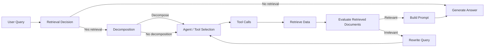

# Agentic RAG

A progressive, educational repository for learning Retrieval-Augmented Generation (RAG) with agentic retrieval logic.

This repository is designed for beginners, students, AI engineers, and developers who want to understand how to build production-grade RAG systems that: 

- combine an LLM with a searchable knowledge base,
- decide when retrieval is needed,
- choose between tools,
- evaluate retrieved documents,
- rewrite failed queries,
- decompose complex questions,
- and construct dynamic prompts for high-quality answers.

---

## Why this repository exists

This repo teaches RAG not as a single script, but as a step-by-step learning path. It begins with a basic retrieval loop and gradually adds real-world agentic capabilities that are essential for robust, efficient, and explainable retrieval systems.

By the end, you will understand the full lifecycle of Agentic RAG:

- document ingestion,
- vector embedding,
- similarity search,
- route-based retrieval,
- tool selection,
- retrieval quality checks,
- query refinement,
- sub-query decomposition,
- prompt construction,
- final answer generation.

---

## What is Agentic RAG?

### Retrieval-Augmented Generation (RAG)

RAG is a pattern where a generative model is supported by an external knowledge source. Instead of relying only on the LLM’s internal memory, the model retrieves relevant documents and uses them to produce an answer.

- **What**: Combine retrieval with generation.
- **Why**: To produce accurate answers from up-to-date or specialized source material.
- **Analogy**: It’s like an expert consulting a reference book while answering a question.
- **Where in this repo**: All notebooks build on this concept.

### Agentic RAG

Agentic RAG adds a decision-making layer around retrieval and tool use. The system behaves like a small agent that can:

- decide whether retrieval is needed,
- select the right source,
- call tools,
- inspect results,
- and adapt if the first attempt fails.

This repo shows how to move from a static RAG pipeline to an agentic architecture that is far more practical for real-world systems.

---

## Repository structure

```text
11_Agentic_Rag/
├── documents/
│   └── evs_oil_price_shock.pdf
├── notebooks/
│   ├── 00_base_rag.ipynb
│   ├── 01_conditional_retrieval.ipynb
│   ├── 02_tool_use_retrieval_1.ipynb
│   ├── 03_tool_use_retrieval_2.ipynb
│   ├── 04_retrieval_evaluation_and_rewriting.ipynb
│   ├── 05_query_decomposition.ipynb
│   └── agentic_rag.ipynb
├── main.py
├── pyproject.toml
├── requirements.txt
└── agentic.pdf
```

- `documents/`: contains the domain-specific PDF used as the knowledge source.
- `notebooks/`: contains the learning path from base RAG to full agentic RAG.
- `main.py`: a simple entrypoint stub.
- `requirements.txt` and `pyproject.toml`: dependency definitions.

---

## How to use this repository

### Prerequisites

- Python 3.12+
- OpenAI API key
- Tavily API key
- Internet access for web search and model calls

### Setup

```bash
cd c:/Generative-AI/RAG/11_Agentic_Rag
python -m pip install -r requirements.txt
```

Create a `.env` file with:

```bash
OPENAI_API_KEY=your_openai_api_key
TAVILY_API_KEY=your_tavily_api_key
```

### Recommended workflow

1. Start with `notebooks/00_base_rag.ipynb`.
2. Continue sequentially through `01_conditional_retrieval.ipynb` and the later notebooks.
3. Finish with `notebooks/agentic_rag.ipynb`.

This order reflects the intended learning journey.

---

## Learning journey and notebook walkthrough

### 00_base_rag.ipynb — Base RAG

**Purpose**: Build the simplest functional RAG pipeline.

**Learning objective**: See how document retrieval and answer generation work together.

**What it introduces**:

- PDF loading with `PyPDFLoader`
- text chunking with `RecursiveCharacterTextSplitter`
- embeddings with `OpenAIEmbeddings`
- semantic search with `Chroma`
- response generation with `ChatOpenAI`
- workflow orchestration using `langgraph.graph.StateGraph`

**Why it exists**: It establishes the foundation. If you do not understand this notebook, the later agentic enhancements will be confusing.

**Workflow**:

1. Load the PDF document.
2. Split it into overlapping chunks.
3. Build embeddings for each chunk.
4. Create a Chroma vector store.
5. Define a retrieval node that searches the vector store.
6. Define a generation node that builds a prompt from retrieved context.
7. Connect the nodes in a graph: `START -> retrieve -> generate -> END`.

**Key takeaway**: Basic RAG is a two-step pipeline where retrieval informs generation.


### 01_conditional_retrieval.ipynb — Conditional retrieval

**Purpose**: Decide whether retrieval is necessary.

**Learning objective**: Learn how to route queries dynamically to avoid useless retrieval.

**What it introduces**:

- route classification with a structured LLM output schema (`needs_retrieval`)
- conditional graph edges in `StateGraph`
- two answer paths: document-backed and general knowledge

**Problem solved**: Not all questions need retrieval. A question like “What is the capital of India?” should not invoke the vector store.

**Workflow**:

1. Classify the query with an LLM.
2. If `needs_retrieval=True`, run retrieval.
3. Otherwise, skip retrieval and answer directly.

**Key takeaway**: Retrieval is a tool, not a default behavior.


### 02_tool_use_retrieval_1.ipynb — Tool-based retrieval

**Purpose**: Introduce agent-style tool use with multiple sources.

**Learning objective**: Learn how an LLM can choose between internal documents and web search.

**What it introduces**:

- `vector_store_search` tool for the domain PDF
- `web_search` tool powered by `TavilyClient`
- `ToolNode` and tool binding with `agent_llm.bind_tools`
- controlled agent prompts that instruct tool selection

**Problem solved**: Build a system that can retrieve from either a cached report or the live web.

**Workflow**:

1. Classify whether retrieval is needed.
2. If yes, invoke an agent with tool access.
3. The agent chooses tools, calls one or both, and returns tool messages.
4. Collect retrieved artifacts and generate a final answer.

**Key takeaway**: Agentic RAG can use multiple tools and combine internal knowledge with external search.


### 03_tool_use_retrieval_2.ipynb — Iterative tool retrieval and safety

**Purpose**: Make tool calls safer and more practical.

**Learning objective**: Learn how to manage multi-round retrieval and avoid runaway agent loops.

**What it introduces**:

- retrieval count tracking
- a retrieval limit node
- iterative tool rounds before final generation

**Problem solved**: Agents can sometimes loop or over-query. This notebook shows how to cap retrieval rounds and make the pipeline stable.

**Workflow**:

1. Classify retrieval need.
2. Run the agent.
3. If tools were called, count the round and either repeat or proceed.
4. Collect tool outputs and generate the answer.

**Key takeaway**: Agentic retrieval needs structured control, not just open-ended tool invocation.


### 04_retrieval_evaluation_and_rewriting.ipynb — Retrieval quality and fallback

**Purpose**: Add robustness when retrieved content is irrelevant.

**Learning objective**: Learn how to evaluate retrieved documents and recover from failed retrieval.

**What it introduces**:

- relevance evaluation with `RelevanceEvaluation`
- filtering retrieved docs before generation
- query rewriting when retrieval fails
- no-answer fallback when the source cannot answer

**Problem solved**: Search results may be off-topic. A strong RAG system must verify relevance and try again if the first pass fails.

**Workflow**:

1. Run the agent and gather tool outputs.
2. Check each retrieved passage for relevance.
3. If relevant docs exist, generate from them.
4. If none are relevant, rewrite the query and retry.
5. If repeated rewriting still fails, return a safe fallback.

**Key takeaway**: Quality control is essential. Retrieval is not enough; the system must ask itself whether the retrieved evidence actually helps.


### 05_query_decomposition.ipynb — Complex query decomposition

**Purpose**: Teach the system to split compound questions into smaller retrieval tasks.

**Learning objective**: Learn how to decompose multi-part questions and retrieve for each part.

**What it introduces**:

- decomposition decision with `DecompositionDecision`
- query splitting into numbered sub-queries
- explicit handling of multi-step retrieval instructions

**Problem solved**: Questions that ask for multiple facts or comparisons confuse single-shot retrieval. Decomposition makes them manageable.

**Workflow**:

1. Decide whether a query needs decomposition.
2. If yes, break it into focused steps.
3. Rewrite the query into a structured multi-step prompt.
4. Let the agent retrieve answers for each step.
5. Synthesize a final response.

**Key takeaway**: Complex queries often require multiple retrieval sub-tasks rather than one generic search.


### agentic_rag.ipynb — Capstone: complete Agentic RAG pipeline

**Purpose**: Combine all previous techniques into one end-to-end architecture.

**Learning objective**: See an integrated Agentic RAG system with retrieval, tool use, evaluation, rewrite, decomposition, and prompt construction.

**What it introduces**:

- dynamic prompt construction based on retrieved evidence
- comprehensive retrieval state tracking
- source-aware answer synthesis
- a final answer node tuned for transparent evidence usage

**Problem solved**: Build a practical end-to-end system that can handle both document-based and live web queries, plus complicated user requests.

**Workflow**:

1. Determine whether retrieval is needed.
2. Check whether decomposition is necessary.
3. If required, decompose the query into steps.
4. Use an agent to call tools.
5. Collect tool outputs.
6. Evaluate relevance.
7. Rewrite if necessary.
8. Build a strong final prompt.
9. Generate the answer.

**Key takeaway**: This notebook is the synthesis of the entire learning path. It shows how all the smaller improvements fit together into an enterprise-ready pipeline.

---

## The complete Agentic RAG workflow

### Conceptual steps

1. **User query**: A question arrives.
2. **Retrieval decision**: Can the model answer from general knowledge, or does it need sources?
3. **Tool selection**: If retrieval is needed, choose the right tool(s).
4. **Document search**: Search the internal knowledge base and/or the web.
5. **Output collection**: Gather retrieved passages and metadata.
6. **Evaluation**: Check whether the retrieval results actually answer the query.
7. **Query refinement**: If not, rewrite the query and search again.
8. **Decomposition**: If the query is multi-part, split it and retrieve for each part.
9. **Prompt construction**: Build a final answer prompt with context, sources, and retrieval reasoning.
10. **Answer generation**: Create the final response.

### Diagram



### Why this matters

A typical RAG system often fails when retrieval is wrong, the query is poorly phrased, or the task is multi-step. Agentic RAG turns retrieval from a brittle plumbing component into a decision-aware process.

---

## Technologies used

### `langchain`

- **What**: A framework for building LLM applications.
- **Why**: It provides prompt templates, tool interfaces, and integration with embeddings and LLMs.
- **Used in this repo**: prompt creation, structured output, tool wrappers, document loading.
- **Advantages**: flexible, composable, widely adopted.
- **Alternatives**: direct OpenAI SDK, LangSmith, LlamaIndex.

### `langgraph`

- **What**: A graph-based workflow library for stateful LLM pipelines.
- **Why**: It supports explicit nodes, conditional routing, and state graphs.
- **Used in this repo**: orchestrating retrieval, routing, agent invocation, evaluation, and generation.
- **Advantages**: makes complex control flow readable and maintainable.
- **Alternatives**: custom code, workflow engines, state machines.

### `Chroma`

- **What**: A vector database for embeddings.
- **Why**: It stores document embeddings and performs similarity search.
- **Used in this repo**: as the retrieval backend for the PDF content.
- **Advantages**: lightweight, in-memory friendly, easy to use.
- **Alternatives**: Pinecone, Weaviate, Milvus, FAISS.

### `OpenAIEmbeddings` and `ChatOpenAI`

- **What**: OpenAI’s embedding and chat models.
- **Why**: Provide semantic search vectors and generative capabilities.
- **Used in this repo**: embedding documents and answering queries.
- **Advantages**: high quality, simple integration.
- **Alternatives**: Azure OpenAI, Anthropic, Claude, local models.

### `Tavily` / `tavily-python`

- **What**: A web search client for live information retrieval.
- **Why**: Enables the agent to answer time-sensitive questions not contained in the PDF.
- **Used in this repo**: as a tool for external web search.
- **Advantages**: adds real-time capability to the agent.
- **Alternatives**: SerpAPI, Bing search, custom scraper.

### `PyPDFLoader` and `RecursiveCharacterTextSplitter`

- **What**: Tools for loading and splitting PDF content.
- **Why**: Documents must be chunked before embeddings can be built.
- **Used in this repo**: to prepare the report for vector indexing.
- **Advantages**: robust document preparation.
- **Alternatives**: other PDF loaders, custom OCR or chunking.

### `python-dotenv`

- **What**: Loads environment variables from `.env`.
- **Why**: Keeps API keys out of source code.
- **Used in this repo**: to load secrets for OpenAI and Tavily.

---

## Practical implementation highlights

- **Graph-based orchestration**: Each notebook builds a `StateGraph` instead of a single monolithic function.
- **Adaptive routing**: The system decides between document retrieval and direct LLM response.
- **Tool fusion**: The agent can query both an internal PDF and an external search source.
- **Recovery strategy**: Relevance evaluation + query rewriting provides a second chance when retrieval misses.
- **Complex task handling**: Query decomposition splits difficult user requests into discrete retrieval subtasks.
- **Prompt engineering**: The final notebook dynamically builds the prompt based on what evidence is available.

---

## Recommended learning path

1. `00_base_rag.ipynb` — learn the basics.
2. `01_conditional_retrieval.ipynb` — learn retrieval control.
3. `02_tool_use_retrieval_1.ipynb` — learn tool-based retrieval.
4. `03_tool_use_retrieval_2.ipynb` — learn retrieval safety and iteration.
5. `04_retrieval_evaluation_and_rewriting.ipynb` — learn robustness and quality checks.
6. `05_query_decomposition.ipynb` — learn multi-part query handling.
7. `agentic_rag.ipynb` — learn the full integrated architecture.

---

## Interview preparation

### Beginner questions

**Q: What is RAG?**
A: RAG combines retrieval from an external knowledge source with LLM generation so the model can answer using fresh or specialized content.

**Q: Why use embeddings in RAG?**
A: Embeddings turn text into vectors so semantic similarity search can find content relevant to the query.

**Q: What does a vector store do?**
A: It stores embeddings and retrieves the most similar document chunks for a query.

### Intermediate questions

**Q: What is conditional retrieval?**
A: It uses a classifier to decide if a query needs retrieval or can be answered from general knowledge.

**Q: Why add tool use to RAG?**
A: Tools let the system access more than one data source, such as internal documents plus live web search.

**Q: How does query rewriting improve RAG?**
A: It refines an unsuccessful or ambiguous query so retrieval can find better results on the next try.

### Advanced questions

**Q: What is agentic retrieval?**
A: An agentic retrieval system treats retrieval as an active decision-making step, allowing the model to choose tools, iterate, and recover from errors.

**Q: How does decomposition improve complex query handling?**
A: Decomposition splits a large request into smaller, focused sub-queries so each part is retrieved and answered correctly.

**Q: How do you prevent tool loops in an agentic pipeline?**
A: Add retrieval limits, explicit routing, and stop conditions so the agent cannot call tools indefinitely.

### Scenario-based questions

**Q: You have a query about a research report and live market data. How should the system respond?**
A: Use a document search tool for the report and a web search tool for the live data, then combine the results in a single answer.

**Q: The system retrieved documents but they were irrelevant. What next?**
A: Evaluate relevance, rewrite the query to be more specific, and retry retrieval before answering.

### Follow-up questions

**Q: When should you skip retrieval?**
A: Skip retrieval for simple factual queries if the model can answer confidently from its training data.

**Q: What is a good no-answer strategy?**
A: Return a transparent fallback message rather than hallucinating a false response.

---

## Common mistakes and pitfalls

- **Embedding raw long text without chunking**: long documents must be split before embedding.
- **Always retrieving for every query**: wastes compute and increases hallucination risk.
- **Trusting the first retrieval pass**: not all retrieved passages are relevant.
- **Using unbounded agent loops**: lacking a retrieval limit can cause runaway tool calls.
- **Overly generic prompts**: specific prompts with context and source guidance lead to better answers.
- **Ignoring no-answer cases**: a safe fallback is better than a confident-but-wrong answer.

### Production recommendations

- cache embeddings and vector store state,
- set strict retrieval limits,
- prefer `needs_retrieval` classification for cost control,
- use relevance evaluation before final generation,
- audit generated answers against sources,
- keep tool prompt instructions explicit and constrained.

---

## One-page cheat sheet

### Core concepts

- **RAG**: retrieval + generation.
- **Agentic RAG**: retrieval decisions and tool-based workflows.
- **Vector store**: semantic database for embeddings.
- **Tool**: a function the agent can call.
- **Decomposition**: split complex questions into sub-queries.
- **Query rewrite**: improve retrieval chance when initial results are poor.
- **Relevance evaluation**: validate retrieved passages before answering.

### Workflow summary

1. Query arrives.
2. Decide if retrieval is needed.
3. If yes, choose tools.
4. Search internal docs or web.
5. Collect retrieved content.
6. Evaluate relevance.
7. Rewrite if necessary.
8. Decompose if the query is multi-part.
9. Build a final prompt.
10. Generate and return the answer.

### Technologies used

- `langchain`
- `langgraph`
- `Chroma`
- `OpenAIEmbeddings`
- `ChatOpenAI`
- `TavilyClient`
- `PyPDFLoader`
- `RecursiveCharacterTextSplitter`

### Things to remember before interviews

- RAG is not just retrieval. It is retrieval plus controlled generation.
- Agentic RAG is about decision-making, not just more tools.
- Always validate retrieval results before trusting them.
- Decomposition and rewriting are practical fixes for hard questions.
- A robust pipeline is stateful and modular.

---

## Final notes

This repository is both a tutorial and a blueprint. Follow the notebooks in order, run the examples, and use them as a foundation for building your own agentic retrieval systems.

For a production deployment, replace local in-memory Chroma storage with a persistent vector database, add logging and monitoring, and keep tool prompts tightly controlled.
