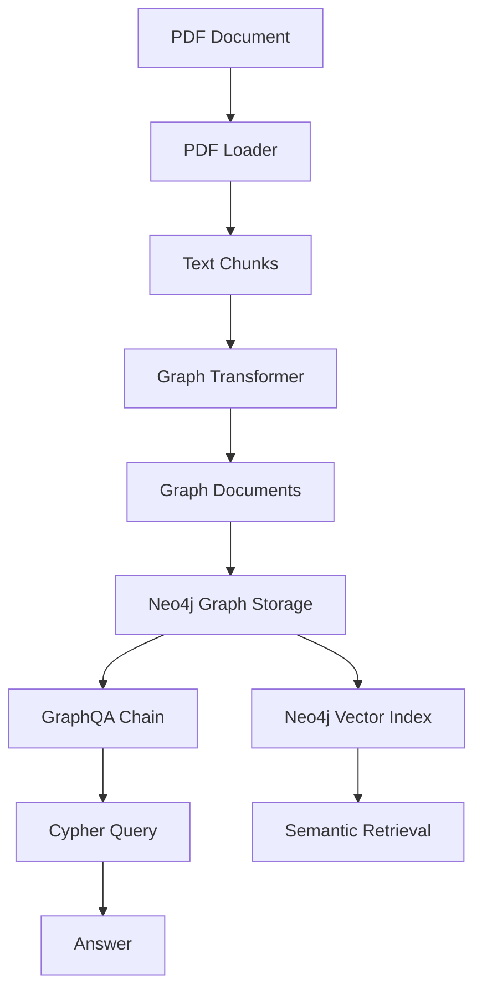

# Graph RAG

## Overview

This repository is a compact, beginner-friendly implementation of Graph RAG: Retrieval-Augmented Generation powered by a knowledge graph.

It teaches how to take unstructured text, convert it into a graph representation with entities and relationships, store that graph in Neo4j, and then answer natural language questions by translating them into graph queries.

This repo is not just code. It is a learning path that covers:

- document ingestion and chunking
- entity and relation extraction using an LLM
- graph construction and graph database storage
- graph-aware retrieval using Cypher and an LLM
- multi-hop question answering over structured knowledge

## Why this repository exists

Most RAG projects focus on text + vector search. Graph RAG adds a second layer of structure: a knowledge graph.
That structure makes it easier to answer questions that require multiple reasoning steps, such as "Which company acquired the supplier of the product used by SpaceX?"

This repository is intentionally small so the learning path is clear:

1. `01_ingestion.ipynb` builds the graph from a PDF.
2. `02_retrieval.ipynb` asks questions against the graph.

---

## What is Graph RAG?

### What?
Graph RAG stands for Graph Retrieval-Augmented Generation.
It is a variation of RAG where the retrieved knowledge is not just text passages, but a graph of entities and relationships.

### Why?
Because graphs encode structure:

- entities like people, organizations, dates
- relationships like works-for, acquired, founded
- paths that connect information across multiple hops

This structure makes it easier to answer complex queries and to reason about relationships.

### Intuition
Imagine your knowledge source is a library of pages. Traditional RAG searches those pages for relevant sentences.
Graph RAG builds a network of facts from those pages, then asks the network questions.

Real-world analogy:
- Traditional RAG = searching an index of books for keywords.
- Graph RAG = building a mind map of concepts and traversing connections.

### Where it is used in this repo
This repository extracts a knowledge graph from `data/elon_musk.pdf`, stores it in Neo4j, and uses graph traversal to answer questions.

---

## What you will learn

By working through this repository, you will learn:

- how to extract meaning from long text using an LLM
- how to build knowledge graph documents from chunked text
- how to persist a graph in Neo4j
- how to create a vector index on graph document nodes
- how to use an LLM to generate Cypher queries safely
- how to answer both single-hop and multi-hop natural language questions

---

## Repository structure

```text
12_Graph_Rag/
  01_ingestion.ipynb
  02_retrieval.ipynb
  data/
    elon_musk.pdf
  graph.pdf
  main.py
  pyproject.toml
  requirements.txt
  steps.md
```

- `01_ingestion.ipynb`: builds the graph and creates a vector index.
- `02_retrieval.ipynb`: connects to Neo4j, generates Cypher, and answers questions.
- `steps.md`: Neo4j setup instructions.
- `graph.pdf`: reference material for Graph RAG concepts.

---

## Setup and quick start

### 1. Install dependencies

This repository uses Python 3.12 or newer.

Install dependencies using your preferred tool. Example with `pip`:

```bash
python -m pip install -r requirements.txt
```

### 2. Configure environment variables

Create a `.env` file in `12_Graph_Rag/` containing:

```env
OPENAI_API_KEY=<your-openai-api-key>
NEO4J_URI=<your-neo4j-uri>
NEO4J_USERNAME=<your-neo4j-username>
NEO4J_PASSWORD=<your-neo4j-password>
```

This repository relies on both OpenAI and Neo4j credentials.

### 3. Neo4j setup

Use `steps.md` to create a Neo4j Aura free instance and store the credentials.

Important notes:

- `NEO4J_URI` should use `neo4j+s://` for TLS.
- `NEO4J_USERNAME` is typically `neo4j`.
- Use the auto-generated password from the dashboard.

### 4. Run the notebooks in order

1. `01_ingestion.ipynb`
2. `02_retrieval.ipynb`

If you run `02_retrieval.ipynb` first, the graph will be empty and the questions will fail.

---

## Notebook walkthrough

### `01_ingestion.ipynb`

#### Purpose

Build a knowledge graph from a PDF and store it in Neo4j.

#### Learning objective

Learn how to convert unstructured documents into graph structures and persist them in a graph database.

#### Problem being solved

How do you take long-form text and turn it into a structured graph of entities and relations? This notebook solves that problem.

#### Workflow

1. Load environment variables with `dotenv`.
2. Create an OpenAI LLM and embedding model.
3. Read the PDF using `PyPDFLoader`.
4. Split pages into small chunks with `RecursiveCharacterTextSplitter`.
5. Convert text chunks into graph documents using `LLMGraphTransformer`.
6. Write the graph documents into Neo4j with `Neo4jGraph`.
7. Build a vector index over the stored `Document` nodes with `Neo4jVector`.
8. Verify graph contents with Cypher queries.

#### Important libraries used

- `langchain_community.document_loaders.PyPDFLoader`
  - loads PDF pages as `Document` objects.
- `langchain_text_splitters.RecursiveCharacterTextSplitter`
  - creates small, overlapping chunks for more accurate entity extraction.
- `langchain_openai.ChatOpenAI`
  - provides the LLM used for graph extraction.
- `langchain_openai.OpenAIEmbeddings`
  - computes embeddings for the graph index.
- `langchain_experimental.graph_transformers.LLMGraphTransformer`
  - converts text chunks into graph documents.
- `langchain_neo4j.Neo4jGraph`
  - stores graph documents in Neo4j.
- `langchain_neo4j.Neo4jVector`
  - creates a vector index from a Neo4j graph.

#### Major code blocks explained

- `PyPDFLoader("data/elon_musk.pdf")`
  - loads one `Document` per PDF page.
- `RecursiveCharacterTextSplitter(chunk_size=300, chunk_overlap=50)`
  - splits pages into short, overlapping text chunks so the LLM can extract entities with less context loss.
- `LLMGraphTransformer(llm=llm)`
  - asks the LLM to identify nodes and relationships in each chunk.
- `graph_transformer.convert_to_graph_documents(chunks)`
  - returns a list of graph-aware document objects.
- `graph.add_graph_documents(graph_docs, include_source=True, baseEntityLabel=True)`
  - saves the graph into Neo4j and ensures every extracted entity is connected back to a source document.
- `Neo4jVector.from_existing_graph(...)`
  - builds a semantic vector index on `Document` nodes for retrieval.

#### Inputs

- `data/elon_musk.pdf`
- OpenAI API key and Neo4j credentials

#### Outputs

- A populated Neo4j graph of entities and relationships.
- A vector index called `elon_musk_chunks`.
- Verification output listing node and relationship counts.

#### Key takeaways

- Graph ingestion is a transform: `text -> chunks -> graph documents -> stored graph`.
- Small chunks help the LLM extract entities and relations more reliably.
- `include_source=True` is crucial for linking graph entities back to their source text.
- Neo4j can host both the graph and the vector index.

---

### `02_retrieval.ipynb`

#### Purpose

Query the knowledge graph using natural language and Cypher.

#### Learning objective

Learn how to use an LLM plus a graph database to answer questions with graph traversal.

#### Problem being solved

How do you convert a natural language question into a graph query that retrieves the right facts?

#### Workflow

1. Load environment variables.
2. Create the same OpenAI LLM used in ingestion.
3. Connect to the existing Neo4j graph.
4. Refresh the Neo4j schema so the chain understands node labels and relationship types.
5. Build a custom Cypher prompt template for the LLM.
6. Create a `GraphCypherQAChain`.
7. Ask both single-hop and multi-hop questions.

#### Important libraries used

- `langchain_openai.ChatOpenAI`
  - the LLM used to generate Cypher.
- `langchain_neo4j.Neo4jGraph`
  - the graph connection and schema retrieval.
- `langchain_neo4j.GraphCypherQAChain`
  - a chain that translates natural language into Cypher and executes it.
- `langchain_core.prompts.PromptTemplate`
  - custom prompt construction.

#### Major code blocks explained

- `graph.refresh_schema()`
  - refreshes the internal graph view so the chain knows which labels and relationship types exist.
- `GraphCypherQAChain.from_llm(...)`
  - creates a retrieval chain that uses the LLM to build Cypher queries.
- The Cypher prompt template
  - teaches the LLM Neo4j syntax rules and enforces case-insensitive matching.
- `cypher_chain.invoke({"query": ...})`
  - sends a natural language question into the chain.

#### Inputs

- Neo4j graph produced by `01_ingestion.ipynb`
- OpenAI API key and Neo4j credentials

#### Outputs

- A natural language answer generated from graph query results.
- Visible Cypher statements when `verbose=True`.

#### Key takeaways

- Graph retrieval can be far more precise than vanilla text retrieval when relationships matter.
- Custom prompt constraints are important for safe Cypher generation.
- Multi-hop questions are the strongest proof of graph power.

---

## The complete Graph RAG pipeline

Learning Graph RAG means understanding both data preparation and retrieval.

### End-to-end flow



### What happens in each stage

- **PDF Loader**: converts a PDF into pages and text documents.
- **Text Chunks**: breaks long pages into smaller pieces so the LLM can extract relationships reliably.
- **Graph Transformer**: uses an LLM to convert text chunks into a graph of nodes and edges.
- **Graph Documents**: the graph representation of each chunk.
- **Neo4j Graph Storage**: stores entities and relationships in a graph database.
- **GraphQA Chain**: translates questions into Cypher and executes them.
- **Answer**: returns the final result.

### Why graph structure matters

A graph preserves explicit relationships, which is why Graph RAG is especially useful for:

- multi-step reasoning
- relationship discovery
- answering "why", "how", and "who connected to whom" questions

### Vector indexing in Graph RAG

This repository also demonstrates how to create a vector index on graph document nodes.
That index supports semantic retrieval and hybrid search, even though the retrieval notebook focuses on graph query execution.

---

## Technologies explained

### `langchain`
- What it is: a framework for building LLM-powered pipelines.
- Why it is needed: it provides reusable building blocks for document loading, splitting, transformers, and retrieval.
- Where used: across both notebooks for the LLM, text splitting, and graph tools.
- Advantages: modular, open-source, widely used.
- Alternatives: `llama_index`, `Haystack`, or custom LLM orchestration.
- Role in this repo: glue layer that connects OpenAI, Neo4j, PDF loading, and graph extraction.

### `langchain-openai`
- What it is: OpenAI-specific adapter for LangChain.
- Why it is needed: to create `ChatOpenAI` and `OpenAIEmbeddings` objects.
- Where used: in both notebooks for text understanding and embedding generation.
- Role: LLM engine.

### `langchain-neo4j`
- What it is: Neo4j integration for LangChain.
- Why it is needed: to store graph documents and run Cypher-based QA.
- Where used: `Neo4jGraph`, `Neo4jVector`, `GraphCypherQAChain`.
- Role: graph persistence and graph retrieval.

### `langchain-experimental`
- What it is: experimental LangChain components.
- Why it is needed: it contains `LLMGraphTransformer`, a cutting-edge tool for graph extraction.
- Role: converts text chunks into structured graph documents.

### `langchain-community`
- What it is: community-built loaders and connectors.
- Why it is needed: it provides `PyPDFLoader` for PDF ingestion.

### `pypdf`
- What it is: a PDF parsing library.
- Why it is needed: to read PDF content into Python.
- Where used: behind the `PyPDFLoader` PDF ingestion.

### `python-dotenv`
- What it is: environment variable loader.
- Why it is needed: to keep API keys and database credentials out of source control.
- Where used: `load_dotenv()` in both notebooks.

### `Neo4j Aura`
- What it is: Neo4j's managed cloud database service.
- Why it is needed: to run a remote graph database without local installation.
- Where used: as the graph host for ingestion and retrieval.
- Advantages: easy setup, TLS support, free tier.
- Alternatives: local Neo4j install, Neo4j Desktop, other graph databases like Dgraph or Amazon Neptune.

### `Cypher`
- What it is: Neo4j's graph query language.
- Why it is needed: to traverse the graph and retrieve answers.
- Where used: generated by the `GraphCypherQAChain`.
- Role: query execution layer.

---

## How this repository teaches Graph RAG

### Learning progression

1. **Document ingestion** teaches the core pattern of converting text into structured graph form.
2. **Graph storage** teaches how to represent real-world facts as nodes and edges.
3. **Graph retrieval** teaches how to convert natural language into graph queries.
4. **Multi-hop reasoning** demonstrates the unique strength of graph-based retrieval.

### Why the notebooks are ordered this way

- `01_ingestion.ipynb` builds the foundation by creating the graph.
- `02_retrieval.ipynb` builds on that foundation by querying the graph.

Skipping the ingestion step would make the retrieval step meaningless, because the graph would not exist.

---

## Practical implementation notes

### What is actually stored in Neo4j?

- nodes representing entities like people, organizations, products
- relationship edges such as `FOUNDED_BY`, `ACQUIRED`, `DIRECTOR_OF`
- source `Document` nodes that link chunks back to the original PDF page

### Why use `include_source=True`?

This ensures the graph can connect extracted facts back to the original text source.
That is essential for auditability, answer grounding, and building a semantic index later.

### Why split text into chunks?

LLMs struggle with very long passages. Chunking:

- reduces prompt length
- improves extraction accuracy
- gives the transformer sharper context

### Why a vector index is created?

Graph RAG is not only graph queries. It can also combine graphs with semantic search. The repository creates a vector index on `Document` nodes so you can later use hybrid retrieval.

---

## Repository summary

### Main objective

Demonstrate a minimal Graph RAG pipeline that extracts a knowledge graph from PDF text and retrieves information with Neo4j and LLM-generated Cypher.

### Concepts demonstrated

- RAG fundamentals
- graph-based knowledge storage
- entity and relationship extraction
- chunking for LLM reliability
- graph database ingestion
- natural language to Cypher translation
- single-hop and multi-hop graph reasoning

### Technologies used

- OpenAI (`gpt-5-mini` and `text-embedding-3-small`)
- LangChain and language connectors
- Neo4j graph database
- Cypher query generation
- PDF ingestion and text chunking

### Learning outcomes

After working through this repo, you should be able to:

- explain what Graph RAG is and why it matters
- build a graph from unstructured text
- connect an LLM to Neo4j for knowledge extraction
- generate structured graph queries from natural language
- reflect on when graphs are better than pure vector search

### Practical implementation highlights

- Uses `LLMGraphTransformer` to turn text chunks into graph documents.
- Stores both entities and source documents in Neo4j.
- Creates a vector index for hybrid retrieval readiness.
- Uses a custom Cypher prompt to avoid Neo4j syntax mistakes.
- Demonstrates both single-hop and multi-hop retrieval.

---

## Interview preparation

### Beginner questions

**Q: What is retrieval-augmented generation?**
A: A technique that uses external data retrieved at runtime to improve LLM responses.

**Q: Why use a graph instead of only text passages?**
A: A graph preserves relationships, enabling multi-hop reasoning and more precise answers.

**Q: What does Neo4j store in this repo?**
A: Entities, relationships, and source `Document` nodes from a PDF.

### Intermediate questions

**Q: Why chunk text before graph extraction?**
A: Because smaller chunks help the LLM extract entities and relations more accurately.

**Q: What is `GraphCypherQAChain`?**
A: A LangChain tool that generates Cypher from natural language and executes it against Neo4j.

**Q: What role does `include_source=True` play?**
A: It links graph nodes back to original source documents for grounding and indexing.

### Advanced questions

**Q: How does Graph RAG differ from hybrid retrieval?**
A: Hybrid retrieval typically combines vector search with sparse search. Graph RAG combines semantic knowledge with explicit graph structure.

**Q: What are the risks of using an LLM to generate Cypher?**
A: It can generate invalid syntax, wrong labels, or unsafe queries; prompt design and schema refresh help reduce those risks.

**Q: What does refreshing the schema do?**
A: It updates the chain with the current node labels and relationship types from Neo4j.

### Scenario-based questions

**Q: You have a graph of company acquisitions and want to answer, "Which acquired firm supplies parts to Tesla?" How would you approach it?**
A: Use the graph query chain to traverse acquisition and supplier relationships, then return the matching company node.

**Q: Your retrieval results are wrong because node IDs are title-cased. What is the fix?**
A: Use case-insensitive comparison in Cypher, for example `toLower(n.id) = toLower(...)`.

**Q: You need to extend this repo to support new documents. What changes are needed?**
A: add new document loaders or sources, re-run ingestion, and optionally update graph indexing for new nodes.

### Follow-up questions

**Q: How would you combine graph retrieval with semantic search?**
A: Use the vector index on `Document` nodes for semantic search, then execute Cypher on the candidate graph subgraph.

**Q: Can Graph RAG handle real-time updates?**
A: Yes, by ingesting new documents and updating the graph incrementally.

**Q: When should you avoid Graph RAG?**
A: For simple factual retrievals where a vector store is enough, or when the graph adds unnecessary complexity.

---

## Common mistakes and best practices

### Beginner mistakes

- running `02_retrieval.ipynb` before `01_ingestion.ipynb`
- using a large chunk size and losing extraction accuracy
- storing credentials directly in code instead of `.env`
- ignoring Neo4j schema refresh

### Common misconceptions

- "Graph RAG is just vector search." No — it adds structured relationships.
- "More nodes always mean better answers." Not if they are noisy or poorly extracted.
- "The graph itself is the final answer." The graph is the knowledge source; retrieval still needs correct query execution.

### Pitfalls while implementing Graph RAG

- failing to normalize case in node ID comparisons
- allowing the LLM to generate unconstrained Cypher
- assuming every text chunk must produce a perfect graph
- not validating graph structure after ingestion

### Performance considerations

- smaller chunks increase accuracy but also increase graph size.
- Neo4j schema and indexing matter for query speed.
- vector indexing adds storage overhead but enables semantic search.

### Production recommendations

- validate graph extraction with schema checks and sample output.
- log Cypher queries and query results for debugging.
- use deterministic LLM settings for extraction tasks.
- separate ingestion and retrieval pipelines.
- consider incremental graph updates rather than full reloads.

---

## One-page cheat sheet

### Core concepts

- **RAG**: augment generation with retrieved external knowledge.
- **Graph RAG**: use a graph database for retrieval.
- **Entity**: meaningful noun like person, company, location.
- **Relationship**: connection between entities.
- **Cypher**: Neo4j query language.
- **Chunking**: splitting text into smaller pieces.
- **Schema refresh**: update graph metadata before query generation.

### Important terminology

- `Neo4jGraph`: stores the graph.
- `Neo4jVector`: builds a vector index from graph documents.
- `LLMGraphTransformer`: extracts graph documents from text.
- `GraphCypherQAChain`: converts natural language into Cypher.
- `PyPDFLoader`: loads PDF pages.
- `Graph Document`: a LangChain object representing nodes and relationships.

### Workflow summary

1. ingest PDF
2. chunk text
3. extract graph elements
4. store graph in Neo4j
5. optionally build vector index
6. refresh graph schema
7. generate and run Cypher
8. answer questions

### Technologies used

- OpenAI LLMs
- Neo4j graph database
- LangChain graph and retrieval tools
- PDF ingestion and text chunking
- environment variable management

### Key takeaways

- Graph RAG is strongest for reasoning over relationships.
- Good graph ingestion depends on chunking and LLM prompts.
- Neo4j + LLM query generation can answer multi-hop questions.
- The repository is a working template for knowledge graph-based retrieval.

### Interview reminders

- emphasize the difference between text retrieval and graph retrieval.
- explain why `include_source=True` matters.
- describe how `GraphCypherQAChain` turns questions into Cypher.
- mention that graph and vector retrieval can be combined.

---

## Notes

This README is designed to be a complete standalone learning guide for the `12_Graph_Rag` repository.
It explains the repository flow, the reasons behind every major choice, and the knowledge needed to teach or interview on Graph RAG.
