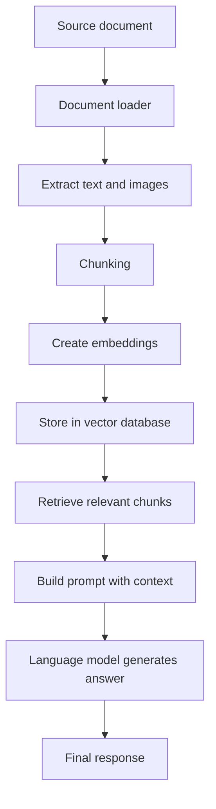

# Multimodal RAG: From Documents to Answers That See and Read

This repository is a compact, hands-on introduction to Multimodal Retrieval-Augmented Generation (RAG). It teaches a simple but powerful idea:

> Instead of asking a language model to answer from memory alone, we first retrieve relevant information from a knowledge source, and then let the model use that retrieved context to answer more accurately.

In this project, that knowledge source is not only text, but also images extracted from a document. That is the core of Multimodal RAG: the system can reason over both written words and visual content.

If you are new to RAG, this repository is a good place to begin because it shows the full idea in a small, understandable workflow.

---

## Why this repository exists

Many beginner-friendly RAG tutorials focus on text only. They show how to retrieve paragraphs and answer questions. This repository goes one step further.

It demonstrates two approaches:

1. A text-first strategy that converts images into descriptive captions and treats those captions as searchable chunks.
2. A true multimodal strategy that uses image-aware embeddings and stores both text and image content in the same retrieval space.

The result is a practical introduction to a modern question: “How can a system answer questions that depend on both text and visuals?”

---

## What you will learn

By the end of this repository, you should be able to explain and implement:

- What RAG is and why it is useful
- What embeddings are and why they matter
- What a vector database is
- How document chunking works
- How retrieval improves generation quality
- Why images can be part of the retrieval process
- How captions can bridge the gap between visual content and language models
- How multimodal embeddings differ from standard text embeddings
- How a simple multimodal RAG pipeline is built with LangChain and Chroma

---

## A beginner-friendly mental model

Before diving into code, it helps to think of the system as a very structured research assistant.

Imagine you ask:

“Can you explain the chart in this document?”

A normal language model may answer from general knowledge, but a RAG system first looks for the relevant parts of the document. It searches for:

- the nearby text,
- the chart’s context,
- any captions or labels,
- and sometimes the image itself.

Then it gives the language model that evidence and asks it to answer carefully.

That is the essence of RAG.

---

## Core concepts explained simply

### 1. Large Language Model (LLM)

An LLM is a model trained on vast amounts of text so it can generate and reason with language. It is useful for answering questions, summarizing, and writing, but it does not always know the latest or most specific information unless we provide it with context.

In this repository, the LLM is used to answer questions after relevant content has been retrieved.

### 2. Retrieval

Retrieval means finding the most relevant pieces of information before answering. Instead of asking the model to rely only on its internal memory, we search a knowledge base first.

Why this matters:
- It reduces hallucination.
- It makes answers more grounded.
- It allows the system to use private or domain-specific documents.

### 3. Embeddings

Embeddings are numeric representations of meaning. A sentence or image is converted into a list of numbers that captures its semantic content.

Intuition:
- Two similar ideas should end up close together in this numeric space.
- A question about a chart should be close to the chart’s textual description or visual representation.

In this repository, embeddings are used to find relevant document chunks and images.

### 4. Vector database

A vector database stores embeddings and supports similarity search. It allows the system to ask: “Which stored items are most similar to this question?”

This is the search engine behind the retrieval step.

### 5. Chunking

Chunking means splitting a large document into smaller pieces. This is important because a language model cannot process a full document efficiently or reliably in every case.

In this repository, text is split into smaller chunks, and image-based content is also represented as chunks.

### 6. Prompt

A prompt is the instruction we give the model. It tells the model what role to play, what context to use, and what kind of answer to produce.

In this repository, the prompt instructs the model to answer using only the retrieved context.

### 7. Multimodal RAG

Multimodal RAG extends standard RAG by allowing the system to work with more than one input type.

Instead of only using text, it can use:
- text passages,
- images,
- charts,
- diagrams,
- screenshots.

This is extremely useful when the answer depends on visual information.

---

## Repository structure

```text
13_Multimodal_Rag/
├── data/
│   └── crag_paper.pdf
├── notebook/
│   ├── strategy1_text_conversion.ipynb
│   └── strategy2_multimodal_embeddings.ipynb
├── main.py
├── pyproject.toml
├── requirements.txt
├── additional_dependencies_installation_steps.md
└── README.md
```

### What each part does

- The notebooks are the main learning material.
- The data folder contains the source document used for retrieval.
- The Python project files define dependencies and the package metadata.
- The installation notes explain OS-level tools needed for document extraction.
- The placeholder Python file is not the main implementation; the notebooks are.

---

## Quick start

### 1. Prerequisites

You will need:

- Python 3.12 or newer
- An OpenAI API key
- Access to the required Python packages
- Optional OS-level tools for document extraction

### 2. Install dependencies

Using pip:

```bash
pip install -r requirements.txt
```

Or with uv if you prefer dependency management:

```bash
uv sync
```

### 3. Install system dependencies

The repository includes a guide for installing the required OS-level packages for document processing. On Windows, this usually means installing Poppler and Tesseract.

### 4. Set your environment variables

Create a .env file with your OpenAI credentials:

```bash
OPENAI_API_KEY=your_key_here
```

### 5. Open the notebooks

The most important files are:

- [notebook/strategy1_text_conversion.ipynb](notebook/strategy1_text_conversion.ipynb)
- [notebook/strategy2_multimodal_embeddings.ipynb](notebook/strategy2_multimodal_embeddings.ipynb)

These are the main implementation files in the repository.

---

## The learning journey of this repository

This repository is not just a collection of notebooks. It is a guided progression from a basic RAG workflow to a more advanced multimodal one.

### Why the first notebook comes first

The first notebook introduces the fundamental idea of building a retrieval pipeline over a document. It teaches:

- how to load content,
- how to split it into chunks,
- how to create embeddings,
- how to store them,
- how to retrieve relevant chunks,
- and how to pass those chunks into a language model.

Without this first step, the second notebook would feel disconnected.

### Why the second notebook exists

The second notebook asks a more advanced question:

“What if the knowledge source includes visual content?”

It introduces the idea that images can be indexed and retrieved in the same retrieval system as text.

That is the main conceptual jump: moving from text-only RAG to multimodal RAG.

---

## Notebook walkthrough

## 1. Strategy 1: Text conversion and caption-based retrieval

File: [notebook/strategy1_text_conversion.ipynb](notebook/strategy1_text_conversion.ipynb)

### Purpose

This notebook shows the first and most intuitive way to make a document “searchable” in a multimodal setting.

It does not try to make the system understand images directly at retrieval time. Instead, it converts each image into a textual description and treats that description as another document chunk.

### Why this strategy exists

This is a practical bridge between traditional text-based RAG and multimodal RAG.

Many vision-language systems can describe images well, but they may not be able to retrieve them as easily as text. This notebook solves that by translating images into text descriptions that can be embedded and searched.

### Workflow

1. Load the document content and extract its elements.
2. Identify visual elements.
3. Use a vision-capable language model to generate captions for the images.
4. Split the text and captions into smaller chunks.
5. Create embeddings for the chunks.
6. Store them in a vector database.
7. Retrieve relevant chunks for a question.
8. Send the retrieved context to the language model.

### Major components

#### Document loading

The notebook uses a document loader to extract structured elements from the source document. This step is important because it allows the system to distinguish between text and images.

#### Image captioning

For each image, the system uses a prompt that asks the model to describe the image in detail. These captions become searchable text.

This is a very important design choice:
- the image is not embedded directly,
- but its meaning is converted into text,
- and then that text is embedded.

#### Chunking

The notebook uses a recursive text splitter to break larger chunks into smaller units. That makes retrieval more precise and efficient.

#### Embeddings

The notebook uses text embeddings from OpenAI. These embeddings capture the semantic meaning of the descriptions and text passages.

#### Vector store

The embeddings are stored in Chroma, which supports efficient similarity search.

#### Retrieval and generation

A retriever returns the most relevant chunks. Those chunks are then passed into a prompt for the language model.

### Why this notebook matters

This notebook teaches the key idea behind many real-world multimodal systems:

> If the system cannot natively reason over images during retrieval, generate a textual representation of the image and make that representation searchable.

### Key takeaways

- Images can be made retrievable by describing them in text.
- Captioning is a practical strategy when image-native retrieval is unavailable.
- Multimodal RAG does not always require a fully multimodal embedding model.

---

## 2. Strategy 2: Native multimodal embeddings

File: [notebook/strategy2_multimodal_embeddings.ipynb](notebook/strategy2_multimodal_embeddings.ipynb)

### Purpose

This notebook introduces a more direct approach. Instead of converting images into captions first, it uses multimodal embeddings that can represent both text and images in the same embedding space.

### Why this strategy exists

This is a more advanced and conceptually richer approach. It shows that images can be indexed directly, without first transforming them into text.

### Workflow

1. Load the document and extract text and images.
2. Split the text into chunks.
3. Use a multimodal embedding model to represent text and images.
4. Store both in the same vector database.
5. Retrieve relevant text and image items for a question.
6. Construct a prompt that includes both retrieved text and the relevant images.
7. Ask the language model to answer.

### Major components

#### Multimodal embeddings

This notebook uses OpenCLIP embeddings. These embeddings are trained to place images and text into a shared semantic space.

That means:
- a caption can be close to its corresponding image,
- a question can match either the relevant text or the related visual content,
- and both modalities can be treated in a unified retrieval system.

#### Chroma as a multimodal store

The notebook uses Chroma to store both text and image entries. This is important because it illustrates that the search system does not need to be text-only.

#### Image retrieval

The notebook retrieves not only text chunks but also the relevant image entries. Those images are then attached to the prompt so the language model can reason over them directly.

### Why this notebook matters

This notebook shows the deeper version of multimodal RAG:

> The system retrieves across modalities, not just across text.

### Key takeaways

- Multimodal embeddings let the system work with text and images in one shared space.
- This approach can be more semantically rich than caption-based retrieval.
- It is especially useful when the answer depends on visual structure, not just descriptive text.

---

## The full multimodal RAG pipeline in this repository

Here is the end-to-end flow represented in the repository.



### Step-by-step intuition

1. A document is loaded.
2. Relevant parts are extracted.
3. The content is broken into smaller pieces.
4. Those pieces are converted into embeddings.
5. A retrieval system finds the most relevant pieces for a question.
6. The retrieved information is passed to the language model.
7. The model produces an answer grounded in the retrieved context.

This is the heart of RAG.

---

## Why the repository is valuable for learning

This repository is valuable because it teaches both the conceptual and the practical side of Multimodal RAG.

It is not just “code that runs.” It helps you understand:

- what problem multimodal RAG solves,
- how the pipeline is structured,
- why each component exists,
- and how the components fit together.

That makes it a strong learning resource for students, engineers, and interview preparation.

---

## Technologies used

### LangChain

What it is:
A framework for building LLM applications with components such as loaders, splitters, embeddings, retrievers, prompts, and chains.

Why it is needed:
It makes the pipeline easier to build and reason about.

Where it is used:
In both notebooks for loading documents, splitting text, creating embeddings, retrieving data, and orchestrating the RAG chain.

Advantages:
- Cleaner abstractions
- Easier experimentation
- Good integration with modern LLM tools

Alternatives:
- LlamaIndex
- Haystack
- Custom Python orchestration

### Chroma

What it is:
A vector database used for storing embeddings and retrieving similar content.

Why it is needed:
It provides the similarity search layer that powers retrieval.

Where it is used:
Both notebooks use Chroma to store and query embeddings.

Advantages:
- Lightweight and easy to use
- Good for experimentation and prototyping
- Works well with LangChain

Alternatives:
- Milvus
- Pinecone
- Weaviate
- FAISS

### OpenAI embeddings

What it is:
Text embeddings generated by OpenAI models that capture semantic meaning.

Why it is needed:
The retrieval system needs a numeric representation of meaning to perform similarity search.

Where it is used:
The first notebook uses them for text chunk retrieval.

Advantages:
- Strong semantic quality
- Easy to integrate
- Very common in production RAG systems

Alternatives:
- Sentence transformers
- Instructor embeddings
- Cohere embeddings

### OpenCLIP embeddings

What it is:
A multimodal embedding model that can represent both images and text in the same space.

Why it is needed:
This makes it possible to retrieve visually relevant content using shared semantic representations.

Where it is used:
The second notebook uses it to build a more native multimodal retrieval system.

Advantages:
- Strong cross-modal matching
- Useful for image and text retrieval
- Conceptually aligned with multimodal RAG

Alternatives:
- CLIP-based variants
- Multimodal embedding models from other providers

### ChatOpenAI

What it is:
A language model interface from OpenAI used for generation.

Why it is needed:
It produces the final answer after retrieval has supplied context.

Where it is used:
Both notebooks use it to answer questions.

Advantages:
- Strong reasoning and language quality
- Easy tool integration
- Widely used in RAG systems

Alternatives:
- Anthropic models
- Gemini
- Open-source LLMs

### RecursiveCharacterTextSplitter

What it is:
A chunking tool that splits text into manageable pieces while preserving local structure.

Why it is needed:
Chunking improves retrieval quality and makes context more focused.

Where it is used:
Both notebooks use it to split long document content into chunks.

### Unstructured document loading

What it is:
A document extraction layer that can parse document content and identify text, tables, and images.

Why it is needed:
The system needs structured access to the content inside the source document.

Where it is used:
Both notebooks use it to extract elements from the source document.

### Python-dotenv

What it is:
A small library for loading environment variables from a .env file.

Why it is needed:
It keeps secrets like API keys out of source code.

Where it is used:
At the beginning of the notebooks.

---

## Common beginner mistakes

### 1. Confusing retrieval with generation

Retrieval finds relevant information. Generation writes the answer. Both are needed, but they are not the same job.

### 2. Using too large a chunk size

If chunks are too large, retrieval becomes less focused. If they are too small, the model may lose context.

### 3. Ignoring image quality

The quality of visual inputs strongly affects retrieval and answer quality. Poor images or weak captions can lead to weak results.

### 4. Assuming the model can “see” everything automatically

Not every system understands images in the same way. Some pipelines rely on captions or embeddings to bridge that gap.

### 5. Treating embeddings as magic

Embeddings are useful, but they are not perfect. Retrieval quality depends heavily on the quality of the index, the chunking strategy, and the query wording.

### 6. Forgetting to ground the answer

A good RAG system should answer using the retrieved evidence rather than inventing details.

---

## Practical tips and best practices

- Keep the retrieval context focused.
- Use clear prompts that say the answer must be based on the retrieved evidence.
- Experiment with chunk size and overlap.
- Compare caption-based and image-native strategies.
- Evaluate the quality of retrieved items, not only the final answer.
- Use a small, known dataset first before scaling to large corpora.
- Keep the retrieval system transparent so you can inspect what was retrieved.

### Production recommendations

For a production-grade system:

- Add evaluation metrics for retrieval accuracy and answer quality.
- Use a more robust chunking strategy for long documents.
- Consider hybrid retrieval with keyword search and semantic search.
- Add caching and asynchronous processing for better efficiency.
- Monitor latency and cost carefully.
- Test with edge cases involving charts, diagrams, and complex layouts.

---

## Interview preparation

## Beginner questions

### What is RAG?

RAG stands for Retrieval-Augmented Generation. It improves a language model by first retrieving relevant information from a knowledge source and then using that information to generate an answer.

### What is the difference between RAG and fine-tuning?

Fine-tuning changes the model’s weights. RAG adds external context at inference time. RAG is often easier to update and more flexible for changing knowledge.

### What is an embedding?

An embedding is a numerical representation of meaning that allows similarity search.

## Intermediate questions

### Why use a vector database in RAG?

A vector database allows efficient similarity search over embeddings, which is the core retrieval step in many RAG systems.

### Why do we split documents into chunks?

Chunking improves retrieval precision, makes context more focused, and reduces the amount of irrelevant information passed to the model.

### What is the role of the retriever?

The retriever finds the most relevant pieces of information for a given query.

## Advanced questions

### What is multimodal RAG?

Multimodal RAG uses multiple data types, such as text and images, in the retrieval and generation pipeline.

### Why would caption-based retrieval be useful?

It is useful when a system cannot directly interpret images during retrieval but can still generate meaningful text descriptions of them.

### How does a multimodal embedding model differ from a text-only embedding model?

A multimodal embedding model maps both images and text into a shared space, making cross-modal retrieval possible.

## Scenario-based questions

### Scenario: The model answers a question about a chart incorrectly.

A good answer would mention that the retrieval step may be missing the chart context, the chunking strategy may be too coarse, or the system may need a better multimodal representation.

### Scenario: Retrieval returns irrelevant chunks.

The answer should mention that chunking, embedding quality, and retrieval settings may need adjustment.

### Scenario: The system cannot understand visual content well.

The answer should mention captioning, multimodal embeddings, or more specialized vision-language models.

## Follow-up questions

### What would you improve first in a RAG system?

I would start by inspecting retrieval quality, because poor retrieval often causes poor answers.

### How would you evaluate a multimodal RAG system?

I would measure retrieval relevance, answer faithfulness, and whether the system correctly uses the visual context.

---

## One-page cheat sheet

### Core concepts

- RAG = retrieve relevant context, then generate an answer
- Embeddings = numeric meaning representations
- Vector database = similarity search over embeddings
- Chunking = splitting a document into smaller searchable pieces
- Prompt = instruction given to the model
- Multimodal RAG = RAG that uses text and images

### Important terminology

- Retriever
- Context window
- Similarity search
- Semantic relevance
- Grounded generation
- Multimodal embeddings
- Captioning

### Workflow summary

1. Load content
2. Extract text and image elements
3. Split content into chunks
4. Create embeddings
5. Store them in a vector database
6. Retrieve relevant items for a query
7. Build a prompt with that context
8. Generate an answer

### Technologies used

- LangChain
- Chroma
- OpenAI embeddings
- OpenCLIP embeddings
- ChatOpenAI
- Recursive text splitting
- Document loaders

### Key takeaways

- RAG improves factual grounding.
- Multimodal RAG extends retrieval beyond text alone.
- Captions are a simple and practical strategy for image-aware retrieval.
- Multimodal embeddings offer a more native approach.

### Remember before interviews

Be ready to explain:
- what retrieval is,
- why embeddings matter,
- how vector search works,
- how RAG differs from fine-tuning,
- and why multimodal systems are useful.

---

## Final summary

This repository is a compact but high-quality introduction to Multimodal RAG. It teaches the core ideas behind retrieval, embeddings, vector search, prompting, and multimodal reasoning in a way that is approachable for beginners and still useful for experienced developers.

If you are learning RAG for the first time, this repository is an excellent starting point. If you are revisiting the topic before interviews, it is also a strong revision resource because it shows both the conceptual and practical sides of the system.
