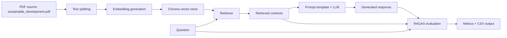
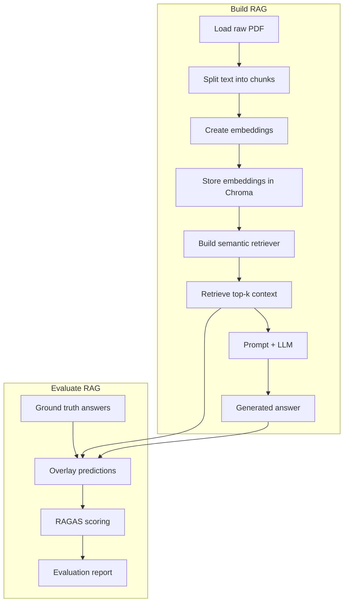

# RAGAS Evaluation for Retrieval-Augmented Generation

Welcome to `14_RAGAS(RAG_Evaluation)`, a hands-on repository for learning how to evaluate Retrieval-Augmented Generation (RAG) systems using the `ragas` evaluation library.

This project is designed to teach:

- what retrieval-augmented generation is
- how retrieval and generation team up in a RAG pipeline
- how RAGAS metrics measure retrieval quality, answer quality, and robustness
- how to build a complete RAG pipeline with LangChain, Chroma, and OpenAI
- how to evaluate a RAG system end to end with real code

This README is both a tutorial and a study guide. It covers the repository layout, the role of every file, the meaning of every notebook, and the full evaluation workflow.

---

## What is this repository?

This repository is a small, practical implementation of a RAG pipeline plus a companion evaluation suite. It focuses on the evaluation side of RAG systems, demonstrating how to use the `ragas` library to score:

- retrieval relevance and retrieval recall
- response faithfulness to retrieved evidence
- robustness against noisy retrieval results
- direct answer relevancy

The repository includes:

- `main.py` — orchestration entrypoint
- `rag_pipeline.py` — builds the RAG pipeline and retriever
- `evaluate.py` — runs evaluation with a small question-answer dataset
- `data/sustainable_development.pdf` — the knowledge source for retrieval
- notebooks showcasing each metric in isolation
- `requirements.txt` and `pyproject.toml`

This repo is ideal for beginners, students, engineers preparing for interviews, or anyone learning how to validate a RAG system instead of only building one.

---

## Why RAG evaluation matters

A RAG system is not complete until it is evaluated. Building a pipeline is only half the work — you also need to know whether the system:

- retrieves the right information
- brings back enough evidence to answer the question
- generates answers that are grounded in retrieved context
- ignores irrelevant or distracting data
- answers the user directly without wandering off-topic

`ragas` gives you structured metrics for those exact problems.

---

## Core concepts for beginners

### What is RAG?

RAG stands for Retrieval-Augmented Generation.

- `Retrieval`: the system searches external documents or knowledge for relevant information.
- `Augmentation`: the retrieved text is passed to the language model.
- `Generation`: the model uses the retrieved evidence to write the final answer.

Imagine writing an essay using a set of reference articles. Instead of answering entirely from memory, the model looks up supporting evidence and then writes a response that is grounded in that evidence.

### Why RAG exists

Large language models are powerful, but their internal knowledge is fixed at training time and may be incomplete or out of date.

RAG solves this by adding an external knowledge layer. The system can access up-to-date documents, domain-specific files, or long technical manuals that the model could not store in its weights.

### What is RAGAS?

`RAGAS` is a library for measuring the quality of RAG systems. It evaluates whether the retrieved context and generated response are:

- accurate
- relevant
- complete
- faithful
- robust

In this repository, `ragas` is used to measure the RAG system as a whole.

---

## Repository structure at a glance

```text
14_RAGAS(RAG_Evaluation)/
├─ data/
│  └─ sustainable_development.pdf
├─ notebooks/
│  ├─ context_precision.ipynb
│  ├─ context_recall.ipynb
│  ├─ faithfulness.ipynb
│  ├─ noise_sensitivity.ipynb
│  └─ response_relevancy.ipynb
├─ evaluate.py
├─ main.py
├─ rag_pipeline.py
├─ requirements.txt
├─ pyproject.toml
└─ README.md
```

- `data/` contains the knowledge source used for retrieval.
- `rag_pipeline.py` builds the vector database, retriever, and prompt chain.
- `evaluate.py` generates responses and feeds them to `ragas` for scoring.
- Notebooks show each `ragas` metric with concrete examples.

---

## Quick start

### 1. Install dependencies

```powershell
python -m pip install -r requirements.txt
```

### 2. Configure your OpenAI credentials

Create a `.env` file in the repository root with:

```text
OPENAI_API_KEY=your_openai_api_key_here
```

### 3. Run the repository

```powershell
python main.py
```

This will:

1. build the RAG pipeline from `data/sustainable_development.pdf`
2. retrieve relevant context for sample questions
3. generate answers with `gpt-5-mini`
4. evaluate the system using `ragas`
5. save results to `evaluation_results.csv`

---

## High-level workflow



This flow shows how the repository moves from source documents to retrieval, generation, and quantitative evaluation.

---

## File-by-file walkthrough

### `rag_pipeline.py`

#### Purpose

Build the RAG pipeline backbone: document loader, text splitter, embeddings, vector store, retriever, prompt, and language model.

#### What it does

- loads a PDF from `data/sustainable_development.pdf`
- splits the document into smaller chunks for semantic search
- converts chunks into numeric embeddings
- stores embeddings in a local Chroma vector database
- creates a retriever that returns the top 4 nearest context chunks
- creates a prompt chain that asks the model to answer only from the retrieved context

#### Why it exists

This file isolates the pipeline construction logic from the evaluation logic. That makes it easier to understand the retrieval stage separately from the scoring stage.

#### Important code

```python
docs = PyPDFLoader(PDF_PATH).load()

chunks = RecursiveCharacterTextSplitter(
    chunk_size=800, chunk_overlap=150
).split_documents(docs)

embeddings = OpenAIEmbeddings(model=EMBED_MODEL)
vectorstore = Chroma.from_documents(chunks, embeddings, persist_directory=CHROMA_DIR)
retriever = vectorstore.as_retriever(search_kwargs={"k": 4})
llm = ChatOpenAI(model=LLM_MODEL, temperature=0)
prompt = ChatPromptTemplate.from_template(...)
chain = prompt | llm
```

#### Key libraries and why they are chosen

- `langchain_community.document_loaders.PyPDFLoader` — loads PDF text reliably.
- `langchain_text_splitters.RecursiveCharacterTextSplitter` — breaks long documents into retrievable chunks while keeping sentences intact.
- `langchain_openai.OpenAIEmbeddings` — generates semantic embeddings using OpenAI.
- `langchain_chroma.Chroma` — stores embeddings and performs nearest-neighbor search.
- `langchain_openai.ChatOpenAI` — provides the LLM used for answer generation.
- `langchain_core.prompts.ChatPromptTemplate` — builds the structured prompt template.

#### Input

- a PDF file containing domain knowledge
- model configuration constants

#### Output

- a `chain` that can answer questions given retrieved context
- a `retriever` that returns semantically relevant document chunks

#### What you learn

- how to build a retrieval pipeline from PDF content
- why text splitting matters
- how embeddings and vector search work together
- how to craft a context-aware prompt

### `evaluate.py`

#### Purpose

Evaluate the RAG pipeline using `ragas` metrics.

#### What it does

- defines a small set of question/ground truth pairs
- uses the retriever to fetch context for each query
- invokes the RAG chain to generate a response
- packages the results into a `ragas` dataset
- computes evaluation metrics and saves them to a CSV file

#### Why it exists

This file demonstrates a complete evaluation loop for a RAG system. It shows not only how to generate answers but also how to measure them against a reference.

#### Important code

```python
for i, (question, ground_truth) in enumerate(QA_PAIRS):
    context_docs = retriever.invoke(question)
    contexts = [doc.page_content for doc in context_docs]

    context_str = "\n\n".join(contexts)
    result = chain.invoke({"context": context_str, "question": question})
    response = result.content

    dataset.append(...)

evaluation_dataset = EvaluationDataset.from_list(dataset)
results = evaluate(dataset=evaluation_dataset, embeddings=embeddings)
```

#### Key libraries

- `openai.AsyncOpenAI` — client for OpenAI API access.
- `ragas.embeddings.base.embedding_factory` — builds embeddings for evaluation scoring.
- `ragas.EvaluationDataset` — creates a dataset structure expected by `ragas`.
- `ragas.evaluate` — computes evaluation metrics on the dataset.
- `pandas` — converts evaluation results into a spreadsheet-friendly format.

#### Input

- list of sample questions and reference answers
- retrieval results for each question
- generated responses

#### Output

- `evaluation_results.csv` containing the computed scores

#### What you learn

- how to package RAG data for evaluation
- how to link retrieved context, user query, responses, and references
- how `ragas` uses embeddings and LLMs to score a RAG system

### `main.py`

#### Purpose

The orchestration entrypoint for the repository.

#### What it does

- loads environment variables
- builds the RAG pipeline
- runs the evaluation script

#### Important code

```python
chain, retriever = build_rag_chain()
run_evaluation(chain, retriever)
```

#### What you learn

- how to structure a small RAG application with separation of concerns
- how to build and evaluate in a reproducible way

---

## Notebook walkthrough

The notebooks are short, focused demonstrations of RAGAS metrics. Each notebook is a learning step in the evaluation journey.

### `context_precision.ipynb`

#### Purpose

Teach how to measure whether retrieved documents are relevant and precise.

#### Learning objective

Understand when a retrieval result contains useful evidence and when it contains irrelevant noise.

#### Problem being solved

If a retriever returns unrelated documents, the LLM may answer incorrectly or hallucinate.

#### Workflow

1. create a `ContextPrecision` scorer with an LLM
2. provide a user question, reference answer, and retrieved context chunks
3. compute a precision score

#### Important concepts

- `ContextPrecision` measures the fraction of retrieved contexts that are actually relevant to the question and reference.
- high precision means the retriever is not returning garbage.

#### Example patterns shown

- relevant context followed by irrelevant chunks
- only relevant chunks
- irrelevant chunks ranked above the relevant one

#### Libraries used

- `openai.AsyncOpenAI`
- `ragas.llms.llm_factory`
- `ragas.metrics.collections.ContextPrecision`

#### Key takeaway

Good retrieval is not just about finding one relevant chunk. It also means keeping irrelevant chunks out of the top results.

### `context_recall.ipynb`

#### Purpose

Teach how to measure whether the retrieved documents cover the answer fully.

#### Learning objective

Understand when retrieval results miss important evidence that is required to answer the question.

#### Problem being solved

A retriever may return relevant text but still fail if it misses key claims needed to answer the question.

#### Workflow

1. create a `ContextRecall` scorer
2. compare retrieved context against a reference answer
3. compute a recall score

#### Important concepts

- `ContextRecall` measures whether the retrieved context includes the necessary information from the ground truth.
- recall is about completeness rather than strict relevance.

#### Example patterns shown

- context covers symptoms but not causes
- context fully covers the reference
- context only addresses treatment while the reference describes causes and symptoms

#### Key takeaway

A high-quality retriever must find enough evidence to answer the question, not just some related text.

### `faithfulness.ipynb`

#### Purpose

Show how to evaluate whether generated answers stay grounded in retrieved evidence.

#### Learning objective

Learn to detect hallucinations and unsupported claims in model outputs.

#### Problem being solved

Even when retrieval is good, the LLM can still invent unsupported details.

#### Workflow

1. create a `Faithfulness` scorer
2. provide user input, candidate response, and retrieved contexts
3. compute a faithfulness score

#### Important concepts

- `Faithfulness` checks if the response is supported by the evidence.
- an unfaithful response may appear fluent but still be wrong.

#### Example patterns shown

- one unsupported claim added to an otherwise correct answer
- response fully supported by the context
- response introducing multiple invented facts

#### Key takeaway

Faithful generation is the core safety metric for RAG systems.

### `noise_sensitivity.ipynb`

#### Purpose

Demonstrate how to evaluate a model's resistance to irrelevant or distracting retrieved information.

#### Learning objective

Understand whether the response is robust when the retriever returns noisy context.

#### Problem being solved

RAG systems are often exposed to noisy retrieval results; a robust answer should ignore unrelated passages.

#### Workflow

1. create a `NoiseSensitivity` scorer
2. provide question, response, reference, and mixed retrieved contexts
3. compute a noise sensitivity score

#### Important concepts

- `NoiseSensitivity` measures whether the model is misled by irrelevant documents.
- it highlights vulnerability to context noise.

#### Example patterns shown

- response includes claims from distracting context
- response stays focused despite noise in the retrieved set

#### Key takeaway

Robust RAG systems should rely on the relevant evidence and ignore unrelated content.

### `response_relevancy.ipynb`

#### Purpose

Measure whether the answer is directly relevant to the user’s question.

#### Learning objective

Distinguish between a direct answer and a response that wanders into tangential information.

#### Problem being solved

A model can sound correct but be irrelevant to the actual query.

#### Workflow

1. create an `AnswerRelevancy` scorer with LLM and embeddings
2. provide question and response
3. compute a relevancy score

#### Important concepts

- `AnswerRelevancy` evaluates whether the response answers the question in a direct and useful way.
- it does not require explicit retrieved context inputs.

#### Example patterns shown

- a correct answer with added unrelated details
- a concise direct answer
- a response that talks around the question without answering it

#### Key takeaway

Relevancy is the final check: even grounded answers must still answer the question cleanly.

---

## The complete RAGAS workflow explained

This repository divides the RAGAS workflow into two broad stages:

1. build the RAG system
2. evaluate it



### Stage 1: Build the RAG system

- **Load** a document (`sustainable_development.pdf`).
- **Split** it into chunks so each retrieval result is manageable.
- **Embed** the text so similar meaning is represented by nearby vectors.
- **Store** the vectors in Chroma for fast semantic search.
- **Retrieve** the top 4 chunks most relevant to a query.
- **Prompt** the model with the retrieved context and the user question.
- **Generate** an answer that is conditioned on the retrieved evidence.

### Stage 2: Evaluate with RAGAS

- **Create a dataset** that pairs user queries with reference answers.
- **Collect retrievals** for each query.
- **Generate responses** from the RAG pipeline.
- **Score** the entire system with metrics such as `ContextPrecision`, `ContextRecall`, `Faithfulness`, `NoiseSensitivity`, and `AnswerRelevancy`.
- **Export** the results to `evaluation_results.csv`.

This is the most important workflow in the repository: it shows how a RAG system is not only assembled but also validated.

---

## Technologies used and why they matter

### `langchain`

- What it is: a framework for building chains of prompts, retrievers, and models.
- Why needed: simplifies the RAG pipeline by connecting document loaders, embeddings, vector stores, and LLMs.
- Where used: `rag_pipeline.py`.
- Advantages: reusable components, modular architecture, community integrations.
- Alternatives: vanilla OpenAI SDK + custom retrieval code, Haystack, LlamaIndex.

### `langchain-community` and `PyPDFLoader`

- What it is: extended loaders and integrations for LangChain.
- Why needed: loads PDF content into the pipeline.
- Where used: `rag_pipeline.py`.
- Advantage: handles PDF parsing and metadata extraction.

### `langchain-text-splitters`

- What it is: text chunking utilities.
- Why needed: breaks long documents into retrieval-friendly pieces.
- Where used: `rag_pipeline.py`.
- Advantage: improves retrieval quality and avoids oversized prompts.

### `langchain-openai`

- What it is: OpenAI model and embedding wrappers for LangChain.
- Why needed: communicates with OpenAI models in a near-native LangChain style.
- Where used: `rag_pipeline.py` and `evaluate.py`.
- Alternatives: direct OpenAI SDK or other provider wrappers.

### `langchain-chroma`

- What it is: a local vector database integration.
- Why needed: stores embeddings and performs nearest-neighbor search.
- Where used: `rag_pipeline.py`.
- Advantage: easy setup for experimentation.
- Limitations: not ideal for massive production workloads, but great for prototypes.

### `openai`

- What it is: official OpenAI Python SDK.
- Why needed: used by `ragas` and `langchain` clients to access models and embeddings.
- Where used: notebooks, `evaluate.py`, `rag_pipeline.py`.

### `ragas`

- What it is: a library for scoring RAG quality.
- Why needed: provides metrics built for retrieval-augmented generation evaluation.
- Where used: notebooks and `evaluate.py`.
- Advantage: focuses on retrieval evidence, faithfulness, robustness, and relevancy.

### `pandas`

- What it is: a data analysis library.
- Why needed: stores evaluation results and writes CSV output.
- Where used: `evaluate.py`.

### `dotenv`

- What it is: environment variable loader.
- Why needed: loads `OPENAI_API_KEY` from a `.env` file.
- Where used: `main.py`.

---

## Learning outcomes

Working through this repository should teach you:

- how to build a simple RAG pipeline from PDF source documents
- how semantic search works in a vector database
- how prompt engineering interacts with retrieved context
- how to structure evaluation datasets for RAG
- why retrieval metrics and response metrics are both necessary
- how to apply `ragas` scoring to answer quality and retrieval quality
- how to interpret evaluation outputs in a real pipeline

---

## Practical implementation notes

### What this repository implements

- a document ingestion workflow for a PDF
- a retriever using semantic embeddings
- a prompt-based answer generation chain
- an evaluation dataset with question/reference pairs
- a `ragas` evaluation run using real model predictions

### What it does not implement

- a full-scale production deployment
- an automated data ingestion pipeline for arbitrary corpora
- a large or balanced evaluation dataset
- advanced prompt templates or multi-stage fusion

This makes it a great learning sandbox but not a production-ready system by itself.

---

## Interview preparation

### Beginner questions

**Q: What is Retrieval-Augmented Generation (RAG)?**
A: RAG uses external documents to augment an LLM’s answer, by retrieving relevant text and conditioning the LLM on it before generation.

**Q: Why do we split documents into chunks before indexing?**
A: Longer documents are split into chunks so retrieval can return manageable, focused passages and avoid oversized prompts.

**Q: What does `Chroma` do in this project?**
A: Chroma stores embeddings and performs nearest-neighbor search to find semantically similar chunks.

### Intermediate questions

**Q: What is `ContextPrecision` measuring?**
A: It measures how many of the retrieved contexts are actually relevant to the query and reference, not just whether the answer is present.

**Q: Why is faithfulness different from relevancy?**
A: Faithfulness checks whether the answer is supported by evidence. Relevancy checks whether the answer actually addresses the question.

**Q: How does the repository use `ragas` in `evaluate.py`?**
A: It builds an `EvaluationDataset`, runs `evaluate()` with embeddings, and converts the returned scores into a CSV.

### Advanced questions

**Q: Why would you use a separate retriever evaluation metric like `ContextRecall`?**
A: Because a retriever can return relevant snippets but still miss critical claims needed to answer the question completely. Recall captures that missing evidence.

**Q: What is noise sensitivity in RAG systems?**
A: Noise sensitivity measures whether the model is misled by irrelevant or distracting retrieved content.

**Q: How could you improve this pipeline for production?**
A: Use a larger, more diverse prompt dataset, persistent vector store on a managed service, more robust retrieval and reranking, a larger evaluation dataset, and explicit hallucination mitigation techniques.

### Scenario-based questions

**Q: The model answers correctly but includes unrelated facts. Which metric helps detect that?**
A: `AnswerRelevancy`.

**Q: The system retrieves some relevant documents but still cannot answer the question. What should you examine?**
A: `ContextRecall`, because it measures whether the retrieved evidence contains the necessary information.

**Q: You see a good answer derived from irrelevant text. Which evaluation metric would catch this failure?**
A: `Faithfulness`, because it checks support between response claims and retrieved context.

### Follow-up questions

**Q: How would you adapt this repository to a new domain?**
A: Replace `sustainable_development.pdf` with domain documents, update the QA dataset to match the domain, and optionally tune the prompt template.

**Q: What would you add to make evaluation more rigorous?**
A: more question-answer pairs, more metrics, human judgments, token-level analysis, and separate train/validation splits.

**Q: When should you use `ragas` instead of simple accuracy?**
A: When you need to validate retrieval and grounding behavior rather than just whether the answer matches a reference exactly.

---

## Common mistakes and pitfalls

- assuming good retrieval always produces a good answer
- using a single reference answer for open-ended questions
- writing prompts that do not constrain the model to the retrieved context
- indexing entire documents without splitting, which makes retrieval coarse
- trusting top-k retrieval without checking relevance and recall
- evaluating only final answers and ignoring retrieval evidence
- using small datasets for conclusions about model quality

### Performance considerations

- `ragas` scoring may use LLM calls and can be expensive for large datasets.
- `Chroma` is fine for experiments, but production systems often use FAISS, Milvus, or managed vector databases.
- narrow prompt templates and smaller top-k values reduce latency but may also reduce answer quality.

### Best practices

- keep retrieval and evaluation code separate
- log both retrieved context and generated response
- compare multiple metrics, not just one
- validate the prompt on a small set before scaling
- use a consistent reference dataset for evaluation

---

## One-page cheat sheet

### Core concepts

- RAG: retrieve documents, then generate answers using them.
- `ragas`: evaluates retrieval and generation quality.
- retrieval metrics: precision and recall.
- response metrics: faithfulness, noise sensitivity, relevancy.

### Important terminology

- `embedding`: numeric representation of text meaning.
- `vector store`: a database for similarity search over embeddings.
- `retriever`: component that finds relevant passages.
- `context`: text returned by the retriever.
- `prompt`: the template used to ask the LLM.
- `reference`: the ground truth answer used for evaluation.

### Workflow summary

1. load PDF
2. split text
3. embed chunks
4. index in Chroma
5. retrieve top-k context
6. generate answer with LLM
7. score with `ragas`

### Technologies used

- OpenAI: embeddings and chat model
- LangChain: pipeline building
- Chroma: vector store
- RAGAS: evaluation metrics
- pandas: results export

### Key takeaways

- evaluation is as important as pipeline construction
- retrieval and generation must both be validated
- `ragas` turns RAG quality into measurable metrics
- a small pipeline can teach large concepts without production complexity

### Things to remember before interviews

- always separate retrieval quality from generation quality
- document chunking is essential for semantic search
- not all correct-sounding answers are faithful
- noise in retrieval can break a RAG system
- evaluation datasets should mirror the intended question style

---

## How to extend this repository

If you want to take this project further, try:

- adding more questions and reference answers
- testing a different PDF or text corpus
- swapping Chroma for another vector store
- adding reranking or query expansion
- computing additional `ragas` metrics
- using a stronger or cheaper LLM depending on your budget
- turning the notebooks into a full report with visual charts

---

## Final note

This project is a learning-focused RAGAS playground. It is not a production deployment, but it is an excellent foundation for understanding the full evaluation lifecycle of retrieval-augmented generation.
