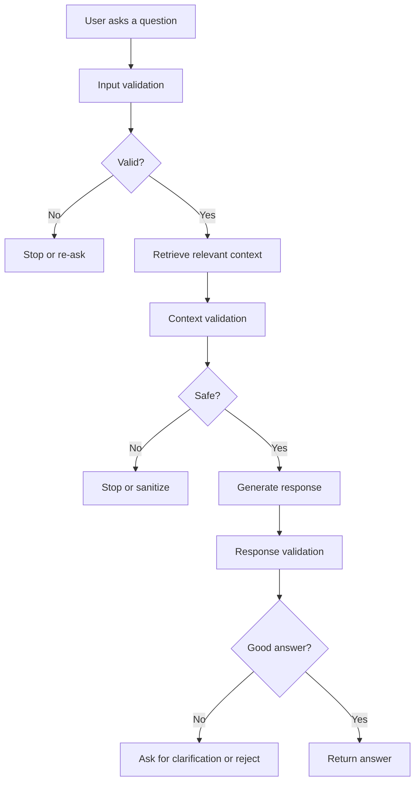

# RAG Guardrails: Safety, Control, and Reliability for LLM Applications

This repository is a practical, beginner-friendly introduction to RAG guardrails. It shows how to make a Retrieval-Augmented Generation (RAG) system safer, more reliable, and more controlled before it is deployed to real users.

If you are new to RAG, do not worry. This README is designed to teach you the concepts from the ground up.

## Why this repository exists

A RAG system combines two ideas:

- Retrieval: finding relevant information from documents or a knowledge base.
- Generation: asking a language model to generate an answer using that retrieved information.

That sounds simple, but in practice, these systems can fail in dangerous or unhelpful ways:

- the user may ask for something unsafe or inappropriate,
- the retrieved context may contain toxic or irrelevant material,
- the model may answer outside the allowed topic,
- the response may expose private information,
- the model may hallucinate or answer with unsupported claims.

Guardrails are the safety checks and control mechanisms that sit around the RAG pipeline. They act like quality control checkpoints in a factory: each stage is inspected before moving on.

This repository teaches those checkpoints using small, focused examples and then brings them together in a graph-based workflow.

---

## What you will learn

By the end of this repository, you should be able to:

- explain what RAG is in plain language,
- explain what guardrails are and why they matter,
- understand the difference between input, context, and response validation,
- build simple validator-based safety checks,
- connect those checks into a LangGraph workflow,
- reason about the trade-offs between safety, flexibility, and user experience.

---

## A beginner-friendly mental model

Think of a RAG system as a student answering a question using a textbook.

1. The student reads the question.
2. The student opens the textbook to find relevant pages.
3. The student uses those pages to answer.
4. The student must also avoid making up facts and must stay within the topic.

A guardrail system is like having a teacher, a librarian, and a reviewer involved at each step:

- The teacher checks whether the question is appropriate.
- The librarian checks whether the textbook pages are trustworthy and relevant.
- The reviewer checks whether the final answer is accurate and safe.

That is exactly the pattern used in this repository.

---

## What is RAG?

RAG stands for Retrieval-Augmented Generation.

It is a pattern where a language model does not rely only on its training memory. Instead, it first retrieves information from a knowledge source such as documents, PDFs, FAQs, or a vector database, and then generates an answer using that retrieved context.

### Why RAG exists

Large language models are powerful, but they have limitations:

- they may not know recent or private information,
- they can invent facts,
- they may be too generic,
- they may not be grounded in your organization’s data.

RAG solves this by attaching external knowledge to the generation step.

### Real-world analogy

Imagine asking a doctor a medical question. A strong doctor does not answer only from memory. The doctor first looks at the patient’s records, medical guidelines, and recent test results. Then the doctor gives an answer based on evidence.

RAG is similar: the model looks at external evidence first, then responds.

### In this repository

This repository does not build a full vector database-based RAG app from scratch. Instead, it focuses on the safety layer around a RAG-like workflow. The key lesson is: even when retrieval works, the output still needs to be controlled.

---

## What are guardrails?

Guardrails are constraints or validation checks placed around an AI system to keep it within acceptable behavior.

They answer questions like:

- Is the input safe?
- Is the context appropriate?
- Is the final response helpful and accurate?
- Is the output aligned with business or ethical rules?

### Why guardrails are needed

Without guardrails, an AI system may:

- respond with harmful answers,
- leak sensitive data,
- go off-topic,
- use toxic language,
- be vulnerable to prompt injection or jailbreak attempts,
- hallucinate confidently.

### Intuition

Guardrails are the difference between a highly capable model and a reliable production system.

A model may be smart, but a production system must also be safe, predictable, and controllable.

### In this repository

The repository implements several guardrails such as:

- PII detection and redaction,
- toxicity screening,
- jailbreak detection,
- topic restriction,
- response evaluation.

These are all examples of validation logic that protects the system from failure modes.

---

## Repository structure

```text
15_Rag_guardrails/
├── main.py
├── rag_guardrails.py
├── pyproject.toml
├── requirements.txt
├── test_graph.ipynb
├── notebooks/
│   ├── competitor_check_guardrails.ipynb
│   ├── jailbreak_guardrails.ipynb
│   ├── pii_guardrails.ipynb
│   ├── response_guardrails.ipynb
│   ├── restrict-to-topic_guardrails.ipynb
│   └── toxicity_guardrails.ipynb
└── guardrails_rag_graph.png
```

### What each file does

- main.py: a minimal starter script.
- rag_guardrails.py: the main implementation showing a complete guardrail-enabled workflow using LangGraph.
- pyproject.toml: dependency and project metadata for the repository.
- requirements.txt: a lighter dependency list for installation.
- notebooks/: small notebook-based examples of individual guardrails.
- test_graph.ipynb: a notebook for experimenting with the graph workflow.

---

## Recommended learning path

If you are a beginner, read the repository in this order:

1. Start with the notebook examples.
2. Understand each guardrail type one by one.
3. Study the graph-based implementation in rag_guardrails.py.
4. Use the graph notebook to see the workflow in action.
5. Revisit the concepts with the interview questions at the end.

This order mirrors the repository’s teaching progression.

---

## The full RAG guardrails workflow

A robust RAG system should be guarded at three major stages:

### 1. Input guardrails

These protect the system before any retrieval or generation happens.

Examples:

- reject toxic or abusive prompts,
- block prompt injection attempts,
- prevent sensitive personal data from entering the system,
- limit the request to allowed topics.

### 2. Context guardrails

These protect the retrieval stage.

Examples:

- ensure retrieved content is safe,
- detect jailbreak attempts hidden in retrieved context,
- block malicious or irrelevant content from influencing the answer.

### 3. Response guardrails

These protect the final answer.

Examples:

- ensure the answer uses the provided context,
- verify the response is relevant to the user’s question,
- reject answers that are off-topic or unsupported.

### Flow diagram



This repository implements exactly that logic in a simplified but instructive way.

---

## Notebook-by-notebook walkthrough

Each notebook is small, focused, and intentionally simple. Together, they teach the idea of one guardrail at a time.

### 1. competitor_check_guardrails.ipynb

#### Purpose
This notebook demonstrates how to detect whether a response or input mentions competing brands or companies.

#### Why it matters
In many business applications, you may want to prevent generated content from favoring or mentioning competitors in unwanted ways.

#### What it teaches
- how to define a set of competitors,
- how to use a validator to inspect user input,
- how to fail safely when a violation occurs.

#### Key idea
This is a content-control guardrail. It enforces business or brand boundaries.

---

### 2. jailbreak_guardrails.ipynb

#### Purpose
This notebook shows how to detect attempts to trick the model into bypassing its intended instructions.

#### Why it matters
A jailbreak attempt is an attempt to make the model ignore its safety rules. In production systems, this is a serious threat.

#### What it teaches
- the concept of prompt injection and jailbreak behavior,
- how a validator can flag suspicious requests,
- how a system can refuse or refrain from answering unsafe prompts.

#### Key idea
This guardrail protects the model from adversarial instructions.

---

### 3. pii_guardrails.ipynb

#### Purpose
This notebook shows how to detect personally identifiable information such as email addresses and phone numbers.

#### Why it matters
A model should not accidentally expose or propagate sensitive personal data.

#### What it teaches
- the idea of PII,
- how to detect common entities,
- how to fix or sanitize content when sensitive data appears.

#### Key idea
This is a privacy protection guardrail.

---

### 4. response_guardrails.ipynb

#### Purpose
This notebook validates whether a model-generated response actually answers the user’s question.

#### Why it matters
A language model can produce a fluent answer that is still irrelevant, weak, or misleading.

#### What it teaches
- the difference between a plausible answer and a correct answer,
- how to evaluate generated output against a question,
- how to use metadata such as the original user query during validation.

#### Key idea
This guardrail checks the quality and relevance of the output.

---

### 5. restrict-to-topic_guardrails.ipynb

#### Purpose
This notebook ensures that the assistant stays within approved topics.

#### Why it matters
A general-purpose assistant may be asked about politics, sports, or entertainment, even when the system is meant to focus on AI or data science.

#### What it teaches
- topic restriction,
- valid vs invalid topics,
- how to reject out-of-scope requests.

#### Key idea
This is a scope-control guardrail.

---

### 6. toxicity_guardrails.ipynb

#### Purpose
This notebook detects toxic or abusive language.

#### Why it matters
AI systems should not amplify harassment, insults, or hateful content.

#### What it teaches
- how toxicity is detected,
- how reasking or refusal can be used when a prompt is harmful,
- how guardrails can shape the user experience gracefully.

#### Key idea
This is a safety and content moderation guardrail.

---

### 7. test_graph.ipynb

#### Purpose
This notebook is the bridge between the isolated validator examples and a full workflow.

#### Why it matters
Real applications do not use only one guardrail in isolation. They combine several checks in sequence.

#### What it teaches
- how multiple validators can work together,
- how a graph-based workflow can model the RAG process,
- how to route between success and failure states.

#### Key idea
This notebook shows the system as a pipeline rather than a single check.

---

## The main implementation: rag_guardrails.py

The main file is rag_guardrails.py, and it is the most important implementation in the repository.

It creates a small but realistic guardrail-enabled workflow using LangGraph.

### What the file does

The file:

- loads environment variables,
- creates several validators,
- builds a state graph,
- validates user input,
- validates the retrieved context,
- generates a response,
- validates the final response.

### Why this file matters

It demonstrates the core pattern of a guardrail-powered RAG workflow:

1. Check the user input.
2. Retrieve context.
3. Check the context.
4. Generate an answer.
5. Check the answer.

### Important components

#### Validators

The repository uses multiple validators:

- PII validator for sensitive information,
- Toxic language validator for abuse or harmful wording,
- Jailbreak detector for adversarial prompts,
- Topic restrictor for scope control,
- Response evaluator for answer quality and alignment.

#### LangGraph state graph

LangGraph organizes the workflow as nodes and edges.

Each node performs a step:

- validate inputs,
- retrieve context,
- validate context,
- generate a response,
- validate response.

This makes the system easier to reason about and easier to extend.

### Important note

The retrieval step is intentionally simple in this repository. It is a placeholder that marks where a real retrieval system would go. The focus is not on vector search itself, but on guarding the pipeline around it.

---

## How the implementation works

Here is the conceptual flow in code form:

1. The system receives a user query.
2. It validates the query.
3. If the input is safe, it continues.
4. It retrieves context.
5. It validates the retrieved context.
6. It sends the validated context and query to the language model.
7. It validates the response.
8. It returns the final answer or a failure state.

This is the core pattern of a guardrailed RAG system.

---

## Technologies used

### Python

Python is the primary language in this repository because it is the lingua franca of AI and data science tooling.

Why it is used:

- excellent ecosystem for LLM workflows,
- strong support for notebooks and experiments,
- easy integration with APIs and ML libraries.

### Jupyter notebooks

The notebooks make it easy to test each guardrail in isolation.

Why they are useful:

- fast experimentation,
- visual inspection of results,
- ideal for teaching and debugging.

### Guardrails AI

Guardrails AI is the library that provides the validation framework.

What it does:

- wraps model outputs with validation checks,
- lets you define validators for safety and structure,
- gives a consistent API for applying rules.

Why it matters here:

It allows the repository to express guardrails in a clear, composable way.

### LangChain

LangChain provides abstractions for LLM applications, prompts, and chains.

Why it is used here:

- prompt management,
- LLM integration,
- support for tool-like application patterns.

### LangGraph

LangGraph is used to represent the workflow as a graph.

Why it is important:

- explicit nodes and edges,
- stateful multi-step workflows,
- clearer control than a single monolithic script.

### OpenAI

The repository uses OpenAI’s chat model through LangChain.

Why it is used:

- strong general-purpose language understanding,
- easy integration with the rest of the stack,
- simple route for generating answers from validated context.

### python-dotenv

This library loads environment variables from a .env file.

Why it is useful:

- keeps secrets out of source code,
- makes API keys easier to manage.

### Guardrails Hub validators

The notebooks use validator packages such as:

- PII validator,
- toxicity validator,
- jailbreak detector,
- topic restriction validator,
- response evaluator,
- competitor checker.

These are reusable rules that can be plugged into a guardrail pipeline.

---

## How to run this repository

### 1. Install dependencies

If you use uv:

```bash
uv sync
```

If you prefer pip:

```bash
pip install -r requirements.txt
```

### 2. Set your environment variables

Create a .env file with your OpenAI API key:

```bash
OPENAI_API_KEY=your_key_here
```

### 3. Run the notebooks

Open the notebooks in Jupyter and run them one by one.

### 4. Run the graph implementation

You can experiment with the graph-based workflow by running the Python file:

```bash
python rag_guardrails.py
```

The current implementation is educational and modular; it is designed to illustrate the pattern clearly rather than to be the final word on production-scale retrieval.

---

## Common mistakes beginners make

### 1. Confusing RAG with guardrails

RAG is about retrieving and generating. Guardrails are about controlling and validating the process.

They are related, but they are not the same thing.

### 2. Thinking a single guardrail is enough

Real systems need multiple layers of protection.

A PII guardrail does not replace a toxicity filter, and a topic restriction does not replace a response evaluator.

### 3. Ignoring the quality of retrieved context

Even a strong model can produce bad output if the retrieved context is weak or irrelevant.

### 4. Overusing strict rules

Too many rigid rules can make the system frustrating for users.

Good guardrails balance safety with usefulness.

### 5. Treating guardrails as a replacement for model quality

Guardrails help control risk, but they do not make a weak model suddenly excellent.

You still need good prompts, good retrieval, and thoughtful system design.

---

## Best practices

- Use guardrails at multiple stages.
- Validate input, context, and output separately.
- Prefer safe failure modes such as refusal, re-asking, or redaction.
- Log guardrail failures to understand what users or prompts are triggering them.
- Keep guardrails explainable and auditable.
- Test edge cases aggressively.
- Make the system human-friendly rather than purely restrictive.

### Production recommendations

For production systems, consider:

- adding human review for high-risk tasks,
- monitoring latency and cost,
- using stricter policies for sensitive domains,
- keeping a feedback loop for false positives and false negatives,
- combining rule-based and model-based validators.

---

## Interview preparation

This repository is also a good study resource for interviews.

### Beginner questions

#### What is RAG?
RAG is a pattern where a language model answers questions using external retrieved information instead of relying only on its training memory.

#### What are guardrails?
Guardrails are safety and validation checks that control how an AI system behaves.

#### Why are guardrails important?
They help prevent unsafe, irrelevant, or harmful outputs and make systems more reliable.

### Intermediate questions

#### What is the difference between input, context, and response validation?
Input validation checks the user’s request. Context validation checks the retrieved evidence. Response validation checks the final answer.

#### Why might you use a graph-based workflow for guardrails?
A graph makes multi-step logic explicit, easier to debug, and easier to extend.

#### What is the role of retrieval in RAG?
Retrieval supplies the external evidence that grounds the model’s answer.

### Advanced questions

#### How would you design a production-grade guardrail pipeline?
You would combine multiple validators, route failures safely, log outcomes, and evaluate both false positives and false negatives.

#### What are the trade-offs of strict guardrails?
Strict guardrails improve safety but may reduce helpfulness or increase false rejections.

#### How do you evaluate guardrail effectiveness?
You measure precision, recall, false-positive rate, false-negative rate, and downstream user impact.

### Scenario-based questions

#### A user asks a harmful question. What should happen?
The system should detect the unsafe request, refuse or re-ask appropriately, and avoid generating harmful content.

#### A retrieved document contains confidential information. What should the system do?
The system should sanitize, block, or avoid using the unsafe context and log the event.

#### The model gives a fluent but incorrect answer. How do you handle it?
Use response validation and groundedness checks, and consider requiring evidence before accepting the answer.

### Follow-up questions

- How would you test guardrails at scale?
- How would you handle user frustration from overblocking?
- How would you monitor drift in a deployed system?

---

## One-page cheat sheet

### Core concepts

- RAG = retrieval + generation
- Guardrails = safety and control checks around AI behavior
- Input validation = protect the request
- Context validation = protect the evidence
- Response validation = protect the answer

### Important terminology

- Prompt injection: a method used to manipulate the model’s instructions
- Jailbreak: a way to bypass safety behavior
- PII: personally identifiable information
- Hallucination: confidently generating false information
- Retrieval context: the evidence pulled from external documents

### Workflow summary

1. Receive user query
2. Validate the query
3. Retrieve context
4. Validate context
5. Generate answer
6. Validate answer
7. Return or reject

### Technologies to remember

- Python
- Jupyter
- LangChain
- LangGraph
- Guardrails AI
- OpenAI
- dotenv

### Key takeaways

- Guardrails make AI systems safer and more trustworthy.
- RAG improves grounding by using external context.
- Guardrails are most effective when applied at multiple stages.
- A good system is not just smart; it is also controlled.

---

## Final takeaway

This repository is not just a collection of notebook examples. It is a compact lesson in how modern AI systems should be designed: retrieve evidence, generate carefully, and validate every important stage.

If you are learning RAG, this repository gives you a strong conceptual foundation. If you are preparing for interviews, it gives you a practical vocabulary for discussing guardrails, safety layers, and production-grade AI systems.
