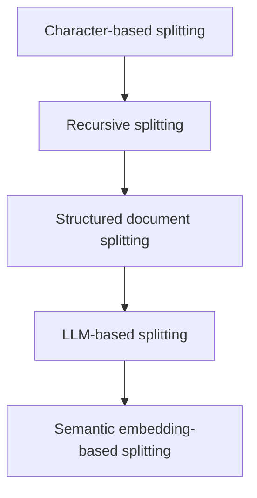
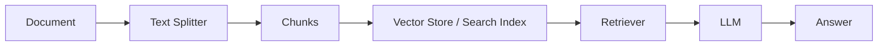

# Text Splitters for RAG: A Practical Guide

This repository is a hands-on introduction to one of the most important ideas in Retrieval-Augmented Generation (RAG): text splitting.

If you have ever wondered why a large language model can answer questions about a long document, the answer is often not just the model itself. It is also the way the document is broken into smaller, meaningful pieces before retrieval happens.

Text splitting is the bridge between raw documents and useful retrieval.

This repo is designed to help you learn that idea from the ground up.

- If you are a beginner, this guide will teach you the core concepts in plain language.
- If you are a student, it will show how splitters fit into RAG systems.
- If you are an engineer, it will give you practical intuition for choosing a splitter in production.
- If you are preparing for interviews, it will help you speak confidently about chunking, overlap, tokens, semantic splitting, and retrieval.

---

## Why this repository exists

A large language model does not read an entire document the way a human does. In most real systems, we:

1. Take a long document.
2. Split it into smaller chunks.
3. Store those chunks in a search or vector store.
4. Retrieve the most relevant chunks at query time.
5. Send them to the model as context.

This process is called retrieval-augmented generation.

The quality of the answer depends heavily on the quality of the chunks. If the chunks are too large, the system may include too much irrelevant information. If the chunks are too small, the system may lose context. If the chunks are poorly chosen, retrieval may fail even when the document contains the right answer.

That is why text splitting matters.

Think of it like this:

- A long document is a book.
- A text splitter is the knife that cuts the book into pages, sections, or paragraphs.
- The retrieval system then uses those pieces to find the right information quickly.

---

## What you will learn

By the end of this repository, you should understand:

- What a text splitter is and why it is necessary.
- The difference between simple splitting and semantic splitting.
- Why chunk size and chunk overlap matter.
- Why token-based splitting can be more useful than character-based splitting.
- How recursive splitters work for code, markdown, and structured text.
- How LLM-based and embedding-based chunking can be more intelligent than rule-based chunking.
- How splitting fits into a complete RAG pipeline.

---

## Repository structure

- notebooks/character_text_splitters.ipynb: beginner-friendly introduction to chunking by character, word boundaries, paragraphs, and overlap.
- notebooks/recursive_text_splitter.ipynb: shows a smarter, hierarchical approach using recursive separators.
- notebooks/document_text_splitter.ipynb: demonstrates splitters for code, JSON, and markdown.
- notebooks/llm_based_splitter.ipynb: uses an LLM to create semantically meaningful chunks.
- notebooks/semantic_text_splitter.ipynb: uses embeddings and semantic similarity to split text based on meaning.
- main.py: a placeholder entry point.
- requirements.txt and pyproject.toml: dependencies for running the notebooks.

---

## Text splitter 101

A text splitter is a component that takes a long piece of text and divides it into smaller parts called chunks.

A chunk is a smaller unit of text that is easier to retrieve, store, and reason about.

### Why do we split text?

We split text because language models and retrieval systems work better when the context is focused.

Without splitting:

- long documents are hard to search efficiently.
- retrieval may bring in too much irrelevant text.
- prompts become too large and expensive.
- the model may lose the exact piece of evidence it needs.

### Core ideas

- Chunk size: how large each chunk should be.
- Chunk overlap: how much context is repeated between neighboring chunks.
- Separator: the boundary used to split text, such as a newline, a space, or a paragraph break.
- Token: a small unit of text used by language models to measure length.
- Embeddings: numeric representations of meaning used to compare text semantically.
- Semantic splitting: splitting based on meaning rather than only punctuation or length.

### Intuition

If you have a 10-page article, you do not want the model to read all 10 pages every time. You want it to read the most relevant pages, or even the most relevant paragraphs.

Chunking makes that possible.

---

## The learning progression in this repository

The notebooks are intentionally ordered from simple to sophisticated.



This progression mirrors a real-world journey:

1. Start with simple rules.
2. Move to more robust heuristics.
3. Handle code, JSON, and markdown.
4. Use LLMs for better topic boundaries.
5. Use embeddings for meaning-aware chunking.

---

## Quick start

### Install dependencies

```bash
pip install -r requirements.txt
```

or with uv:

```bash
uv sync
```

### Run the notebooks

Open the notebooks in the notebooks/ folder and run them in order.

> For the LLM-based and semantic splitters, you will need access to an OpenAI API key through your environment variables.

---

## Notebook walkthrough

### 1. Character-based splitting

Notebook: notebooks/character_text_splitters.ipynb

#### Purpose

This notebook introduces the simplest possible idea: cut text into chunks using a fixed size and a chosen separator.

#### What it teaches

- What a chunk is.
- What chunk size means.
- What chunk overlap means.
- How separators affect splitting.
- How the same text can produce very different chunks depending on the rules.

#### Key workflow

The notebook uses CharacterTextSplitter with:

- chunk_size
- chunk_overlap
- separator
- length_function

It first splits a paragraph of AI-related text into chunks using an empty separator, then tries different separators such as spaces and double newlines.

#### Why this notebook comes first

It is the safest place to begin because it shows the mechanics of chunking without introducing too many abstractions.

#### Important intuition

A splitter is not just a formatting tool. It is a decision-making tool. It decides what context the retriever will see later.

#### Key takeaways

- Smaller chunks are more focused but may lose context.
- Larger chunks preserve more context but may become noisy.
- Overlap helps preserve continuity between neighboring chunks.
- Character-based splitting is simple but naive.

---

### 2. Recursive character splitting

Notebook: notebooks/recursive_text_splitter.ipynb

#### Purpose

This notebook introduces a more practical splitter that tries to break text at natural boundaries such as paragraphs, sentences, and lines.

#### What it teaches

- Why simple character splitting can be too blunt.
- How recursive splitting creates better chunks.
- How chunking works for ordinary prose.

#### Key workflow

The notebook uses RecursiveCharacterTextSplitter on short example text and then on a longer document. It demonstrates how the splitter prefers separators in a hierarchy, such as:

- double newlines
- single newlines
- spaces

#### Why this notebook matters

In real systems, documents are not just random text. They often contain structure. Recursive splitting is often the default choice because it works well across many domains.

#### Key takeaways

- Recursive splitters are more robust than naive character splitting.
- They are a strong default starting point for many RAG systems.
- They preserve meaning better by respecting natural boundaries.

---

### 3. Splitters for structured documents

Notebook: notebooks/document_text_splitter.ipynb

#### Purpose

This notebook shows that not all content is plain prose. Code, JSON, and markdown have their own structure.

#### What it teaches

- How to split Python code sensibly.
- How to split JSON objects into meaningful chunks.
- How to split markdown using header structure.

#### Key workflow

The notebook demonstrates three special cases:

- RecursiveCharacterTextSplitter with Language.PYTHON for Python code.
- RecursiveJsonSplitter for JSON data.
- MarkdownHeaderTextSplitter for markdown documents.

#### Why this notebook is important

Many production systems work with structured content. A generic text splitter may break code or markdown in a poor way. Specialized splitters help preserve structure.

#### Key takeaways

- Code should often be split by logical blocks, not by arbitrary characters.
- JSON should be chunked while preserving object boundaries.
- Markdown is easier to retrieve when headings are preserved.

---

### 4. LLM-based splitting

Notebook: notebooks/llm_based_splitter.ipynb

#### Purpose

This notebook shows a more intelligent approach: let an LLM decide where a document should be split.

#### What it teaches

- That splitting can be treated as a reasoning task.
- How to use a structured output schema with Pydantic.
- How to build a prompt that asks the model to split text and summarize each chunk.

#### Key workflow

The notebook:

1. Defines a chunk schema with text and summary fields.
2. Builds a ChatPromptTemplate.
3. Sends the text to ChatOpenAI.
4. Receives structured chunk output.

#### Why this notebook matters

Rule-based splitters are fast and cheap, but they do not understand the topic boundaries of a document. An LLM can sometimes do better when the text contains mixed themes or subtle transitions.

#### Important caveat

This approach is more expensive and slower than traditional splitters. It is useful when quality matters more than cost.

#### Key takeaways

- LLM-based splitting can create more meaningful chunks.
- It is useful for mixed-topic or poorly structured documents.
- It requires careful prompting and cost considerations.

---

### 5. Semantic splitting

Notebook: notebooks/semantic_text_splitter.ipynb

#### Purpose

This notebook introduces the most advanced idea in the repo: splitting based on semantic similarity.

#### What it teaches

- What embeddings are.
- How embeddings represent meaning numerically.
- How a semantic chunker can split text where topics change.

#### Key workflow

The notebook uses SemanticChunker with OpenAIEmbeddings. It splits text that mixes unrelated themes such as AI, cooking, and climate change.

#### Why this notebook matters

A semantic splitter looks at meaning, not just punctuation. It is especially helpful when a document contains several ideas that are close in surface form but conceptually different.

#### Key takeaways

- Semantic chunking is more meaning-aware than rule-based splitting.
- It is powerful for retrieval quality.
- It is usually more expensive than rule-based methods.

---

## How text splitting fits into RAG

A complete RAG workflow usually looks like this:



### Step-by-step intuition

1. A document arrives.
2. The splitter turns it into chunks.
3. Each chunk is embedded into a vector representation.
4. The vectors are stored for fast similarity search.
5. When a user asks a question, the retriever finds the most relevant chunks.
6. The language model uses those chunks as context to answer.

This is why chunking is not just a preprocessing detail. It is a core part of retrieval quality.

---

## Technologies used

### LangChain

What it is: a framework for building LLM applications.

Why it is needed: it provides reusable components for splitting, prompting, chaining, and document handling.

Where it is used: every notebook uses LangChain-related splitters and document types.

Advantages: fast prototyping, production-friendly abstractions, strong ecosystem support.

Alternatives: Haystack, LlamaIndex, custom Python implementations.

---

### LangChain Text Splitters

What it is: the library that provides CharacterTextSplitter, RecursiveCharacterTextSplitter, and related utilities.

Why it is needed: it makes chunking practical and consistent.

Where it is used: in all of the notebooks.

Advantages: simple API, good defaults, support for multiple document types.

Alternatives: custom splitting logic, other frameworks.

---

### OpenAI models and embeddings

What it is: language models and embedding models from OpenAI.

Why it is needed: embeddings are essential for semantic splitting and retrieval.

Where it is used: in the LLM-based and semantic splitter notebooks.

Advantages: strong quality and easy integration.

Alternatives: Azure OpenAI, local embedding models, open-source alternatives.

---

### Pydantic

What it is: a Python library for data validation and structured output.

Why it is needed: it ensures that the LLM returns a predictable structure.

Where it is used: the LLM-based splitter notebook uses Pydantic to define chunk schemas.

Advantages: reliability, type safety, cleaner outputs.

Alternatives: plain dictionaries, dataclasses.

---

### tiktoken

What it is: a tokenizer used to count tokens.

Why it is needed: token counting helps estimate chunk size more accurately than character counting.

Where it is used: the character splitter notebook includes a token-based example.

Advantages: close to the actual model tokenization behavior.

Alternatives: manual counting, other tokenizer libraries.

---

### Python and Jupyter

What it is: the core programming environment for the notebooks.

Why it is needed: these notebooks make experimentation and visualization easy.

Where it is used: throughout the repo.

Advantages: rapid iteration and educational clarity.

Alternatives: scripts, notebooks in other languages, web apps.

---

## Practical selection guide

How do you choose a splitter?

- Use CharacterTextSplitter when you want a simple baseline.
- Use RecursiveCharacterTextSplitter when you want a robust default.
- Use document-aware splitters for code, markdown, or JSON.
- Use LLM-based splitting when topic boundaries are subtle and quality matters.
- Use semantic chunking when you need meaning-aware division and can afford higher cost.

A common production path is:

1. Start with recursive splitting.
2. Measure retrieval quality.
3. Move to semantic splitting only if the baseline is insufficient.

---

## Common mistakes and pitfalls

### 1. Using very large chunks

This can make retrieval too noisy and cause the model to see too much irrelevant context.

### 2. Using very small chunks

This can break context and produce fragmented retrieval results.

### 3. Ignoring overlap

Overlap helps preserve continuity, especially when important information spans boundary lines.

### 4. Treating all documents the same

Code, markdown, and JSON should not always be chunked the same way as normal prose.

### 5. Choosing semantics without measuring quality

Semantic splitting can improve retrieval quality, but it is not always necessary. Always evaluate on real data.

### 6. Overusing LLM-based chunking

LLM-based chunking is powerful but expensive. Use it when needed, not by default.

### 7. Forgetting evaluation

The best splitter is not the most complex one. It is the one that improves retrieval quality for your task.

---

## Best practices for production

- Start simple and benchmark.
- Keep chunk size and overlap configurable.
- Preserve document structure whenever possible.
- Use overlap to reduce boundary loss.
- Evaluate retrieval quality with real queries.
- Choose the splitter based on document type and retrieval objective.
- Monitor retrieval latency and cost.

---

## Interview preparation

### Beginner questions

#### What is a text splitter?
A text splitter divides a long document into smaller chunks so that retrieval and prompting are more effective.

#### Why is chunk overlap useful?
It preserves context across adjacent chunks and reduces the risk of losing important information at boundaries.

#### What is a chunk?
A chunk is a smaller piece of text produced by a splitting strategy.

### Intermediate questions

#### What is the difference between character-based and recursive splitting?
Character-based splitting uses fixed-size boundaries, while recursive splitting tries to respect natural separators such as paragraphs and sentences.

#### Why might you use a recursive splitter instead of a character splitter?
Because recursive splitting usually produces more meaningful chunks and preserves context better.

#### What is the role of tokens in chunking?
Tokens are a model-friendly measure of length, often more relevant than plain character count.

### Advanced questions

#### When would you choose semantic chunking over recursive chunking?
When the document contains mixed or conceptually shifting topics and retrieval quality benefits from meaning-aware boundaries.

#### Why might LLM-based chunking be useful?
It can understand topic transitions more intelligently than simple heuristics, especially for complex documents.

#### How does chunking affect RAG quality?
Poor chunking leads to irrelevant context, missing evidence, and weaker answers. Good chunking improves retrieval precision and recall.

### Scenario-based questions

#### A document contains a mixture of code, prose, and markdown. What would you do?
Use a splitter strategy that preserves structure, such as code-aware or markdown-aware splitting.

#### A retrieval system gives poor results even though the document contains the right information. What should you inspect first?
Inspect chunk size, overlap, separator choice, and whether the splitter is preserving the right context.

#### Your retrieval system is expensive. How might you reduce cost?
Use smaller or more efficient chunks, reduce LLM-based splitting, and evaluate whether semantic splitting is actually necessary.

### Follow-up questions

- What is the difference between retrieval precision and recall?
- Why might overlapping chunks hurt performance in some cases?
- How would you evaluate a chunking strategy in a real product?

---

## One-page cheat sheet

### Core concepts

- Chunk: a small piece of a larger document.
- Chunk size: controls how much content each chunk contains.
- Chunk overlap: repeats some context between neighboring chunks.
- Separator: the boundary used to split text.
- Token: a model-level unit of text length.
- Embedding: a numerical representation of meaning.
- Semantic splitting: splitting based on content meaning rather than simple rules.

### Workflow summary

1. Read the document.
2. Choose a splitter.
3. Split into chunks.
4. Store or index the chunks.
5. Retrieve relevant chunks at query time.
6. Pass them to the model as context.

### Things to remember before interviews

- Chunking is not cosmetic; it directly affects RAG quality.
- Simple splitters are fast and explainable.
- Semantic splitters are smarter but more expensive.
- The best splitter depends on the document type and the use case.

---

## Summary

This repository teaches a central truth of modern AI systems:

Good retrieval depends on good chunking.

The notebooks move from simple rule-based splitting to more sophisticated semantic strategies, giving you a practical path from beginner to practitioner.

If you understand the ideas in this repository, you will understand one of the most important design choices behind real-world RAG systems.
