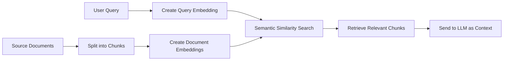
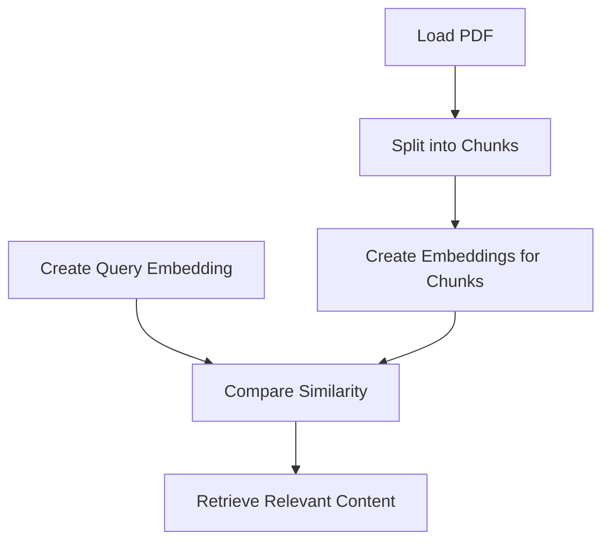

# Embedding Models for RAG: A Practical Introduction

This repository is a compact, beginner-friendly introduction to one of the most important ideas in modern AI systems: embeddings.

If you are new to Retrieval-Augmented Generation (RAG), this repo will help you understand the core building block behind many modern search and question-answering systems:

- how text is converted into numbers,
- how those numbers capture meaning,
- how similar pieces of text can be found automatically,
- and how this idea powers retrieval in RAG pipelines.

The repository is intentionally small and focused. Instead of hiding the mechanics behind a large framework, it shows the essential steps clearly and directly.

---

## Why this repository exists

Embeddings are the bridge between human language and machine reasoning.

A large language model can read and generate text, but it does not “understand” text the way a human does. To make machines work with meaning, we often convert words, sentences, and documents into vectors: lists of numbers that represent semantic content.

This is the purpose of embedding models.

Think of it like this:

- a human reads a paragraph and understands its topic,
- a machine converts that paragraph into a point in a mathematical space,
- and similar ideas end up near each other in that space.

That is why embeddings are so useful in RAG:

- a user asks a question,
- the system turns that question into an embedding,
- it compares that embedding to embeddings of stored documents,
- and it retrieves the most relevant passages.

This repo demonstrates that idea using two practical examples:

1. local embeddings with Ollama
2. cloud embeddings with OpenAI

---

## What you will learn

By the end of this repository, you should be able to:

- explain what an embedding is in simple terms,
- understand why embeddings are useful for semantic search,
- convert text into embeddings using different models,
- compare local and API-based embedding providers,
- see how document chunking and embedding generation fit into a RAG workflow,
- understand the difference between query embeddings and document embeddings,
- interpret embedding dimensions and why they matter.

---

## The big idea: how embeddings fit into RAG

A RAG system usually follows this pattern:

1. A document is loaded.
2. The document is split into smaller chunks.
3. Each chunk is converted into an embedding.
4. A user query is also converted into an embedding.
5. The system finds the chunks whose embeddings are closest to the query embedding.
6. Those chunks are sent to an LLM as context.

Here is the flow:



This repository focuses on the first half of that pipeline: embedding creation and representation.

---

## Repository structure

```text
3_Embedding_Models/
├── main.py
├── pyproject.toml
├── requirements.txt
├── notebooks/
│   ├── ollama_embeddings.ipynb
│   └── openai_embeddings.ipynb
└── Openclaw_Research_Report.pdf
```

### What each file does

- [main.py](main.py): a minimal starter script.
- [pyproject.toml](pyproject.toml): project metadata and dependency definition.
- [requirements.txt](requirements.txt): dependency list for the environment.
- [notebooks/ollama_embeddings.ipynb](notebooks/ollama_embeddings.ipynb): demonstrates embeddings using a local Ollama model.
- [notebooks/openai_embeddings.ipynb](notebooks/openai_embeddings.ipynb): demonstrates embeddings using OpenAI's embedding API.
- [Openclaw_Research_Report.pdf](Openclaw_Research_Report.pdf): the sample document used for embedding experiments.

---

## Prerequisites

Before running the notebooks, make sure you have:

- Python 3.12 or newer
- an active internet connection if you are using OpenAI embeddings
- Ollama installed and running if you want to use the local notebook
- an OpenAI API key if you want to run the OpenAI notebook

### Install dependencies

Using pip:

```bash
pip install -r requirements.txt
```

Or with uv:

```bash
uv sync
```

### Ollama setup

If you want to run the Ollama notebook, pull the embedding model first:

```bash
ollama pull embeddinggemma
```

### OpenAI setup

For the OpenAI notebook, create a environment variable like this:

```bash
export OPENAI_API_KEY="your-api-key"
```

You can also load it from a `.env` file using `python-dotenv`.

---

## Conceptual foundation

### What is an embedding?

An embedding is a numerical representation of text.

Instead of storing words as symbols like “cat” or “dog”, we convert them into vectors such as:

```text
[0.12, -0.43, 0.91, 0.05, ...]
```

These vectors are designed so that semantically related text ends up close together.

### Why do embeddings exist?

Because computers do not natively understand language the way humans do. They work with numbers. Embeddings give machines a way to represent meaning numerically.

### Why are embeddings useful?

They help with:

- semantic search,
- similarity matching,
- recommendation systems,
- clustering,
- retrieval in RAG systems.

### A real-world analogy

Imagine a library where books are arranged by topic instead of by title.

If you place a book about marine biology near other biology books, it becomes much easier to find related books. Embeddings do something similar: they place text in a mathematical “library” where related meanings are near each other.

### What is a vector?

A vector is just an ordered list of numbers. In this context, it is the machine-readable form of a piece of text.

### What does dimensionality mean?

The length of the vector is called its dimensionality.

For example:

- a 256-dimensional embedding is a list of 256 numbers,
- a 512-dimensional embedding is a list of 512 numbers.

Higher dimensions can capture more detail, but they also increase computational cost and memory use.

---

## The learning journey in this repository

This repository is designed as a gentle progression:

1. First, it introduces the simplest idea: convert a query into an embedding.
2. Then it shows how a whole document can be turned into embeddings after splitting it into smaller pieces.
3. Finally, it compares two different embedding providers: Ollama and OpenAI.

That progression matters because it mirrors the real workflow in a RAG system.

---

## Notebook 1: Ollama embeddings

Notebook: [notebooks/ollama_embeddings.ipynb](notebooks/ollama_embeddings.ipynb)

### Purpose

This notebook shows how to generate embeddings locally using Ollama.

It is useful when you want:

- privacy,
- local execution,
- control over the model,
- lower dependence on cloud APIs.

### Learning objective

Understand the fundamental workflow of embedding generation without needing a remote provider.

### What the notebook demonstrates

The notebook:

- loads a PDF document,
- splits it into chunks,
- creates embeddings for a user query,
- creates embeddings for document chunks,
- compares local embedding generation with a LangChain wrapper.

### Main workflow

1. Load the PDF using PyPDFLoader.
2. Split the document into smaller chunks using RecursiveCharacterTextSplitter.
3. Create an embedding for a query.
4. Create embeddings for each chunk.
5. Inspect the output shape and dimensions.

### Important concept: chunking

Before embedding, long documents are usually split into chunks.

Why? Because:

- a full document may be too long for a single embedding,
- retrieval works better on smaller, focused passages,
- chunking improves granularity and relevance.

The notebook uses:

```python
chunker = RecursiveCharacterTextSplitter(
    chunk_size=300,
    chunk_overlap=50,
)
```

This means each chunk is about 300 characters long, with some overlap to preserve context.

### Key code patterns

```python
query = "What is Openclaw/Moltbot and what are the major security concerns regarding this tool"

query_embeddings = ollama.embed(
    model="embeddinggemma",
    input=query,
)
```

```python
loader = PyPDFLoader(file_path="../Openclaw_Research_Report.pdf")
docs = loader.load()
```

### Libraries used

- `ollama`: direct access to local embedding models
- `langchain_ollama`: LangChain integration for embeddings
- `langchain_text_splitters`: chunking utilities
- `langchain_community.document_loaders`: PDF loading

### Why these libraries were chosen

They allow the notebook to remain simple while demonstrating the real mechanics of embedding generation.

### Key takeaways

- embeddings can be generated locally,
- the workflow is the same even when the provider changes,
- model choice affects quality, speed, and resource usage.

---

## Notebook 2: OpenAI embeddings

Notebook: [notebooks/openai_embeddings.ipynb](notebooks/openai_embeddings.ipynb)

### Purpose

This notebook shows how to generate embeddings using OpenAI’s embedding API.

It is useful when you want:

- strong general-purpose embeddings,
- a managed API endpoint,
- easy integration into production systems.

### Learning objective

Understand how embeddings differ across providers and how model size influences representation quality and cost.

### What the notebook demonstrates

The notebook:

- loads the same document,
- creates embeddings for a query,
- compares the large and small OpenAI embedding models,
- generates embeddings for document chunks,
- shows how dimensions can be customized.

### Main workflow

1. Load environment variables.
2. Create two embedding model objects:
   - `text-embedding-3-large`
   - `text-embedding-3-small`
3. Generate embeddings for a query.
4. Generate embeddings for document chunks.
5. Inspect output lengths and vector sizes.

### Important concept: model size and dimensionality

The notebook uses two different OpenAI embedding models:

- `text-embedding-3-small`
- `text-embedding-3-large`

The “small” model is usually cheaper and faster, while the “large” model often provides richer representations, though at a higher cost.

The notebook also demonstrates a custom dimension setting:

```python
embedder_large_custom_dim = OpenAIEmbeddings(
    model=MODEL_LARGE,
    dimensions=256,
)
```

This shows that embedding size can be tuned, which matters for storage and latency in real-world systems.

### Key code patterns

```python
from langchain_openai import OpenAIEmbeddings

embedder_large = OpenAIEmbeddings(model="text-embedding-3-large")
embedder_small = OpenAIEmbeddings(model="text-embedding-3-small")
```

```python
embeddings_large = embedder_large.embed_query(text=query)
```

### Why this notebook matters

It introduces the practical reality that embedding models are not all the same:

- different models have different strengths,
- different dimensions affect cost and performance,
- provider choice depends on your system requirements.

### Key takeaways

- cloud-based embedding APIs are easy to use,
- the same pipeline works with different providers,
- embedding choices influence quality, speed, and cost.

---

## Embedding models explained

An embedding model is a model trained to turn text into dense vectors that preserve semantic meaning.

### What makes an embedding model special?

It learns patterns such as:

- “dog” and “puppy” are conceptually similar,
- “bank” as a financial institution and “river bank” are different meanings,
- questions about the same topic often have related vector representations.

### Why does this matter?

Because a retrieval system can search by meaning instead of exact keyword matching.

For example, if a user asks:

> “What are the cybersecurity risks of this tool?”

the system can retrieve a passage that uses the phrase:

> “major security concerns”

even if the wording is not identical.

That is the power of embeddings.

### A simple mental model

Imagine every sentence as a point in space.

- related ideas cluster together,
- unrelated ideas are farther apart,
- the system can find the nearest neighbors.

That is exactly what retrieval uses.

### Dense vs sparse representations

- dense embeddings: continuous, semantic, and compact representations used in modern RAG
- sparse representations: based on term frequency and exact token overlap, less semantic

Modern RAG systems mostly use dense embeddings.

### Local vs remote embeddings

- local embeddings: run on your machine, good for privacy and experimentation
- remote embeddings: provided by an API, often stronger and easier to integrate

This repository shows both.

---

## Technologies used

### Python

- Python is the underlying language for the repo.
- It is the most common choice for AI and data workflows because of its ecosystem.

### LangChain

- LangChain provides building blocks for LLM and RAG workflows.
- In this repo, it is used to wrap embedding models and simplify the process.

### LangChain OpenAI

- This package connects Python code to OpenAI’s embeddings API.
- It is a practical way to use models like `text-embedding-3-small` and `text-embedding-3-large`.

### LangChain Ollama

- This package allows LangChain to communicate with locally hosted Ollama models.
- It is useful for running embeddings without sending data to a remote service.

### Ollama

- Ollama lets you run open models locally.
- It is helpful for learning, prototyping, and privacy-sensitive environments.

### LangChain text splitters

- These utilities break long documents into chunks.
- Chunking is essential for effective retrieval.

### PyPDFLoader

- This loader reads PDF files.
- It turns a PDF into document objects that can be processed by the pipeline.

### python-dotenv

- This library loads environment variables from a `.env` file.
- It keeps API keys and settings out of source code.

### Why these tools are used here

The repository is not trying to teach every possible technology. Instead, it emphasizes the core idea: turn text into embeddings and use them for retrieval.

---

## Summary of the repository

### Main objective

Teach the fundamentals of embedding generation for RAG systems.

### Concepts demonstrated

- embeddings
- vector representations
- semantic similarity
- chunking
- document loading
- local vs cloud embedding models

### Technologies used

- Python
- Ollama
- OpenAI embeddings
- LangChain
- PyPDF
- text splitters

### Learning outcomes

After working through this repo, you should be able to:

- explain what embeddings are,
- generate embeddings for queries and documents,
- understand how embeddings support retrieval,
- compare local and cloud implementations,
- recognize the role of chunking and dimensionality.

---

## Practical workflow in one picture



This is the essence of the repository.

---

## Interview preparation

### Beginner questions

#### Q1: What is an embedding?

An embedding is a numeric representation of text that captures its meaning in a vector space.

#### Q2: Why are embeddings useful in RAG?

They let the system retrieve semantically relevant content even when the exact wording differs.

#### Q3: What is chunking?

Chunking is the process of splitting a long document into smaller pieces before embedding or retrieval.

### Intermediate questions

#### Q4: What is the difference between a query embedding and a document embedding?

A query embedding represents the user’s question, while document embeddings represent stored content. Retrieval compares them to find relevant passages.

#### Q5: Why might you prefer Ollama over OpenAI for embeddings?

You might prefer Ollama for local execution, privacy, or experimentation.

#### Q6: Why do embeddings need dimensions?

Dimensions define the size of the vector and influence how much semantic detail can be represented.

### Advanced questions

#### Q7: How do embeddings support semantic search?

They place related pieces of text close together in vector space, allowing similarity-based retrieval.

#### Q8: What is the trade-off between small and large embedding models?

Smaller models are often faster and cheaper, while larger models may provide richer semantic understanding at higher cost.

#### Q9: Why is chunking important in RAG?

It improves retrieval granularity and makes the context more focused and relevant.

### Scenario-based questions

#### Q10: A retrieval system returns irrelevant results. What would you investigate?

You would check chunk size, chunk overlap, embedding quality, model choice, and whether the query and documents are being embedded consistently.

#### Q11: You need a privacy-preserving RAG system. What would you choose?

A local model such as Ollama would be a strong choice.

### Follow-up questions

- What happens if the embedding model is poor?
- How does retrieval quality change with chunk size?
- Why might a semantic search fail even when embeddings are correct?

---

## Common mistakes

### 1. Confusing embeddings with keywords

Embeddings are not just keyword matching. They capture meaning.

### 2. Ignoring chunking quality

Bad chunking can destroy context and reduce retrieval accuracy.

### 3. Using overly large chunks

Large chunks may contain too much irrelevant content.

### 4. Forgetting that embeddings are not the entire RAG system

Embeddings are only one piece. Retrieval quality also depends on chunking, prompt design, and the quality of the underlying model.

### 5. Assuming more dimensions always means better results

More dimensions can help, but they also cost more memory and compute.

---

## Best practices

- start simple with one document and one embedding model,
- test retrieval quality manually before scaling,
- use meaningful chunk sizes and overlap,
- compare multiple embedding providers if possible,
- keep your prompts and retrieved context well structured,
- document the exact model and dimension settings you use.

### Production recommendations

For production systems:

- evaluate retrieval quality systematically,
- monitor latency and cost,
- choose models based on task complexity,
- store embeddings efficiently,
- consider a vector database for large-scale search,
- test with real user queries rather than toy examples.

---

## One-page cheat sheet

### Core concepts

- Embedding: a numerical representation of meaning
- Vector: a list of numbers used to represent text
- Semantic similarity: closeness in embedding space
- Chunking: splitting documents into smaller parts
- Retrieval: finding the most relevant passages

### Important terminology

- query embedding
- document embedding
- dimensionality
- chunk overlap
- local model
- API-based model

### Workflow summary

1. Load text or PDF
2. Split into chunks
3. Create embeddings for chunks
4. Create an embedding for the query
5. Compare similarity
6. Retrieve relevant chunks

### Technologies used

- Python
- Ollama
- OpenAI embeddings
- LangChain
- PyPDFLoader
- RecursiveCharacterTextSplitter

### Key takeaways

- embeddings turn text into meaning-rich numbers,
- similarity search is the heart of retrieval,
- chunking and model choice matter a lot,
- the same core idea powers many modern AI systems.

### Things to remember before interviews

- Be able to explain embeddings in simple words.
- Be clear about the difference between exact matching and semantic matching.
- Mention chunking, dimensionality, and retrieval context.
- Show that you understand embeddings are part of a larger RAG pipeline.

---

## Final note

This repository is small, but it teaches a foundational idea that appears everywhere in modern AI systems. If you understand embeddings well, you will be much more comfortable with retrieval, search, recommendation, clustering, and RAG.

If you want to go further after this repo, the next natural step is to connect embeddings to a vector database and build a complete retrieval pipeline.
