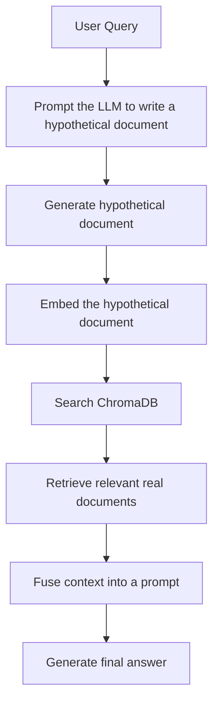

# HyDE: Learn Retrieval-Augmented Generation Through Hypothetical Document Embeddings

This repository is a compact, beginner-friendly introduction to HyDE, or Hypothetical Document Embeddings. It shows how a language model can improve retrieval by first generating a plausible answer-like document, then using that synthetic document to search a knowledge base.

If you are new to RAG, this repository is designed to teach the idea from the ground up. You do not need prior knowledge of vector databases, embeddings, or LangChain to follow it.

---

## Why this repository exists

Many beginner-friendly RAG tutorials stop at the surface:

- load documents
- embed them
- store them in a vector database
- retrieve similar chunks
- ask the LLM to answer

That is useful, but it leaves an important question unanswered: why does retrieval sometimes fail when the user asks a short or vague question?

HyDE addresses that problem. Instead of embedding the raw query directly, it asks an LLM to imagine what a strong, relevant document might look like. That imagined document is then embedded and used for retrieval.

This repository shows that idea in the simplest possible form.

---

## What you will learn

By the end of this repository, you should be able to explain:

- what Retrieval-Augmented Generation (RAG) is
- why retrieval sometimes struggles with short or ambiguous queries
- what embeddings and vector search are
- why HyDE can improve retrieval quality
- how a minimal HyDE pipeline is implemented in code
- how the pieces fit together in a real LLM application

---

## The big idea in plain English

Imagine you are a librarian helping a student who asks:

> “How do transformer models use attention?”

A normal search system might look for text that literally contains those words. But the best answer might be hidden in a longer explanation about self-attention, multi-head attention, or sequence modeling.

HyDE makes the search more intelligent by first asking:

> “If I were writing a high-quality document that answers this question, what would it say?”

That generated document is then used as the search query. In other words, instead of searching with a short question, you search with a richer, more informative hypothesis.

That is the core intuition behind HyDE.

---

## A beginner-friendly roadmap

This repository teaches the concept in a natural progression:

1. Start with the idea of RAG
2. Understand why naive semantic retrieval can miss relevant content
3. See how HyDE creates a hypothetical document
4. Use that document to improve retrieval
5. Pass the retrieved context to an LLM for the final answer

---

## 1. What is RAG?

Retrieval-Augmented Generation, or RAG, is a pattern where a language model does not rely only on its internal training memory. Instead, it first retrieves relevant information from an external knowledge source, then uses that information to answer.

### Why RAG exists

Large language models are powerful, but they have limitations:

- they can hallucinate
- they may not know recent facts
- they may not know private or domain-specific information
- they can be expensive to retrain

RAG solves this by giving the model access to fresh, relevant, external context at inference time.

### Real-world analogy

Think of an LLM as a student who has studied a lot, but who does not automatically have access to the latest textbook on demand. RAG acts like giving that student a relevant chapter before asking the question.

### In this repository

The repository creates a small knowledge base of documents and uses retrieval to ground answers in those documents.

---

## 2. What is an embedding?

An embedding is a numerical representation of text. It is a way of turning words, sentences, or documents into vectors—lists of numbers that capture meaning.

### Why embeddings matter

If two pieces of text are semantically similar, their embeddings tend to be close together in vector space. This allows a system to search by meaning, not just by exact keyword overlap.

### Intuition

A keyword search asks: “Do these words match?”

An embedding-based search asks: “Do these ideas match?”

### In this repository

The notebook uses OpenAI embeddings to convert documents and queries into vectors. Those vectors are stored and searched in Chroma.

---

## 3. What is a vector database?

A vector database stores embeddings and supports similarity search. It lets you ask: “Which stored documents are most similar to this query embedding?”

### Why it is needed

A normal database is excellent for exact matching, but not ideal for semantic similarity. A vector database is designed for meaning-based retrieval.

### In this repository

Chroma is used as the vector store. Documents are embedded and inserted into a Chroma collection, and retrieval is performed against that collection.

---

## 4. What is HyDE?

HyDE stands for Hypothetical Document Embeddings.

The idea is simple but powerful:

1. take the user’s query
2. ask the LLM to generate a hypothetical document that would answer it well
3. embed that hypothetical document
4. use it to search the vector store
5. retrieve real documents that are semantically relevant to that imagined answer

### Why HyDE helps

Sometimes the user’s query is too short or too abstract to retrieve the right document directly. A generated hypothetical document often contains the vocabulary and concepts that the real relevant content uses.

### Intuition

If the user asks a vague question, the system can “imagine the ideal answer” and use that richer representation to find the real source.

### When HyDE is useful

HyDE is especially helpful when:

- queries are short
- queries are ambiguous
- the target documents are long and concept-dense
- the retrieval task is semantic rather than lexical

### Limitations

HyDE is not always better. It adds an extra LLM call and can sometimes introduce retrieval errors if the generated hypothetical document drifts too far from reality.

---

## 5. How the repository is structured

| File | Purpose |
| --- | --- |
| [hyde.py](hyde.py) | Implements the custom HyDE retriever logic |
| [hyde_implementation.ipynb](hyde_implementation.ipynb) | Main educational notebook showing the full pipeline |
| [main.py](main.py) | Minimal entry point placeholder |
| [requirements.txt](requirements.txt) | Installation dependencies |
| [pyproject.toml](pyproject.toml) | Project metadata and dependency declaration |

---

## 6. The implementation in this repository

The most important implementation lives in [hyde.py](hyde.py). It defines a custom retriever class named `CustomHypotheticalDocumentEmbedder`.

Its logic is intentionally simple:

- generate a hypothetical document from the query
- use that document as the retrieval input
- return the documents retrieved from the vector store

That is the essence of HyDE.

### The main workflow

```python
from hyde import CustomHypotheticalDocumentEmbedder

hyde_retriever = CustomHypotheticalDocumentEmbedder.from_llm(
    llm=document_llm,
    retriever=retriever,
)

retrieved_docs = hyde_retriever.invoke("How do transformer models use attention?")
```

The class uses a prompt template that instructs the LLM to write a hypothetical document rather than answer the user directly.

---

## 7. End-to-end HyDE pipeline



### Stage-by-stage explanation

1. User asks a question
2. A document-generating LLM creates a plausible answer-like document
3. That document is embedded
4. Similar chunks are retrieved from the vector store
5. The retrieved context is combined with the original query
6. A generation LLM answers using the retrieved context

This is more powerful than a naive query-to-document retrieval because the search input becomes richer and more semantically aligned with the knowledge base.

---

## 8. Repository walkthrough

The central notebook is [hyde_implementation.ipynb](hyde_implementation.ipynb). It is the main teaching artifact in this repository.

### Notebook purpose

The notebook demonstrates a complete educational HyDE pipeline using a small synthetic corpus about AI, physics, technology, and medicine.

Its purpose is not to build a production-grade system. Its purpose is to make the idea of HyDE easy to understand.

### Why the notebook is structured this way

The notebook follows a teaching sequence:

1. introduce the concept
2. create a small document set
3. index those documents in Chroma
4. instantiate a HyDE retriever
5. run a query through HyDE
6. merge the retrieved context
7. generate a grounded answer

That order matters because each step builds on the previous one.

---

## 9. Detailed notebook walkthrough

### Notebook 1: HyDE implementation

This notebook is the heart of the repository.

#### 1. Setup and imports

The notebook imports:

- `load_dotenv` to load environment configuration
- `ChatOpenAI` for language model calls
- `OpenAIEmbeddings` for embedding generation
- `Chroma` for vector storage and retrieval
- `Document` from LangChain for representing documents
- `ChatPromptTemplate` for guiding the LLM
- `CustomHypotheticalDocumentEmbedder` from [hyde.py](hyde.py)

These imports are chosen because they let the notebook demonstrate the full flow with minimal code.

#### 2. Document corpus creation

The notebook creates a set of richly written documents across several domains:

- AI
- physics
- technology
- medicine

This is an important design choice. The corpus is intentionally diverse so the retrieval behavior is visible and meaningful.

Each document is stored as a LangChain `Document` with:

- `page_content`: the actual text
- `metadata`: tags such as `source` and `topic`

This makes the example easy to inspect and explain.

#### 3. Vector store setup

The documents are embedded using `text-embedding-3-small` and inserted into a Chroma collection named `hyde_demo`.

This step teaches the core idea of semantic search:

- convert documents to embeddings
- store them in a vector store
- later retrieve documents by similarity

#### 4. HyDE retriever setup

The notebook creates two LLMs:

- `document_llm`: used to generate the hypothetical document
- `generation_llm`: used to produce the final answer

This separation is important because the two tasks are different:

- retrieval generation needs a precise, document-like output
- answer generation benefits from a more conversational tone

#### 5. Retrieval using HyDE

The notebook runs a query such as:

> “How do transformer models use attention to process sequences?”

The HyDE retriever:

- prompts the model to write a hypothetical document
- embeds that generated document
- searches Chroma for real documents that are semantically similar

This is the most important conceptual step in the notebook.

#### 6. Context fusion

The retrieved documents are joined into a single context string.

This is a common RAG pattern because the final answer generation step usually needs multiple chunks of context rather than a single one.

#### 7. Final answer generation

The final prompt combines:

- the original user question
- the retrieved context

The generation LLM then answers using that grounded context.

That is the end-to-end RAG loop.

---

## 10. The custom HyDE class explained

The implementation in [hyde.py](hyde.py) is small, but it teaches a very important pattern.

### The class structure

The class `CustomHypotheticalDocumentEmbedder` has three core parts:

- `from_llm(...)`: creates the retrieval chain
- `_generate_hypothetical_document(...)`: asks the LLM to write the hypothetical document
- `invoke(...)`: runs the whole process for a query

### Why this design is useful

It packages the logic into a reusable object that behaves like a retriever. That makes the HyDE idea easy to plug into a larger RAG application.

### What the prompt is doing

The prompt instructs the model to write a document that would answer the query, not to answer the query directly.

That distinction matters. The model is not being asked to “talk to the user.” It is being asked to produce an answer-like artifact that can be embedded and used for retrieval.

---

## 11. Why HyDE can outperform naive semantic search

A naive semantic-retrieval system embeds the user’s raw query and searches for similar documents.

That can work, but it has a weakness:

- the query may be short
- the query may use phrasing that does not match the target documents
- the desired document may be conceptually related but lexically different

HyDE helps because the generated hypothetical document often contains more informative language and the relevant concepts.

### Example intuition

Suppose the user asks:

> “How does attention work in transformers?”

The best source document may contain phrases like:

- self-attention
- query-key-value projections
- weighted sums
- sequence processing

A raw query embedding might not capture those terms well. A hypothetical document is more likely to include them.

That makes the retrieval step more accurate.

---

## 12. Technologies used and why they matter

### Python

Python is the main programming language because it has excellent support for LLM tooling, notebooks, and data science workflows.

### LangChain

LangChain provides abstractions for prompts, LLMs, document loading, and retrieval. It is used here to make the pipeline readable and modular.

### LangChain Core

This provides core abstractions such as `Document`, prompts, and runnable pipelines. It is the foundation of the custom retriever design.

### OpenAI embeddings

These convert text into dense vectors that capture semantic relationship. They are the backbone of similarity search in this repo.

### ChatOpenAI

This powers the LLM calls for generating the hypothetical document and the final answer.

### Chroma

Chroma is the vector database used for indexing and retrieving documents. It is lightweight and easy to use for demonstrations.

### python-dotenv

This loads environment variables from a local `.env` file, keeping secrets out of the code.

### Jupyter / IPykernel

These support the interactive notebook workflow used in the repo.

---

## 13. How to run this project

### 1. Install dependencies

```bash
pip install -r requirements.txt
```

### 2. Set your OpenAI API key

Create a `.env` file with:

```env
OPENAI_API_KEY=your_api_key_here
```

### 3. Open the notebook

Run [hyde_implementation.ipynb](hyde_implementation.ipynb) in Jupyter or VS Code.

### 4. Experiment with queries

Try different prompts such as:

- “How do transformers use attention?”
- “What is quantum entanglement?”
- “How do mRNA vaccines work?”

Compare the retrieved documents and see how HyDE changes the search behavior.

---

## 14. What this repository teaches you conceptually

This repository is not only about code. It also teaches a mental model:

- retrieval is about finding the right evidence
- a good query is often more than a short question
- language models can help create better search inputs
- retrieval quality can be improved by transforming the query into a richer representation

That is a powerful idea in modern RAG systems.

---

## 15. Common mistakes and misconceptions

### Beginner mistakes

- Confusing HyDE with simple query expansion
- Thinking HyDE is always better than standard retrieval
- Forgetting that the generated hypothetical document can hallucinate
- Ignoring the cost and latency of adding an extra LLM call

### Common misconceptions

- HyDE is not a magic retrieval method
- It does not replace embeddings or vector search
- It is not a standalone answer generator
- It is a retrieval strategy, not a complete RAG system

### Best practices

- use HyDE when the query is short or ambiguous
- keep the generated document focused and factual
- evaluate retrieval quality on real tasks
- compare HyDE with baseline dense retrieval
- use it selectively rather than everywhere

### Production recommendations

For real systems, consider:

- caching repeated queries
- reranking retrieved documents
- adding evaluation datasets
- monitoring retrieval quality
- using more robust prompt engineering
- combining HyDE with hybrid search or sparse retrieval

---

## 16. Interview preparation

### Beginner questions

#### Q1. What is RAG?

A1. RAG is a pattern where an LLM retrieves relevant external information before answering, so the response is grounded in retrieved context.

#### Q2. What is HyDE?

A2. HyDE generates a hypothetical document from the user query, embeds that document, and uses it to retrieve real documents from a vector store.

#### Q3. Why use embeddings?

A3. Embeddings let the system compare text by meaning rather than just exact word overlap.

### Intermediate questions

#### Q4. Why might a raw query fail to retrieve the right documents?

A4. The query may be too short, too ambiguous, or use different vocabulary than the target documents.

#### Q5. How does HyDE improve retrieval?

A5. It creates a richer representation of the information need by generating a plausible document that captures the likely concepts and terminology.

#### Q6. What are the trade-offs of HyDE?

A6. It can improve retrieval quality, but it introduces extra latency and cost and may amplify hallucinations if the generated document drifts too far.

### Advanced questions

#### Q7. When would you prefer HyDE over standard dense retrieval?

A7. When the query is sparse or ambiguous and the target content is concept-heavy, long-form, or semantically different in wording.

#### Q8. What are the main failure modes of HyDE?

A8. Poor prompt design, overly speculative hypothetical documents, and retrieval drift caused by generating text that does not align with the actual knowledge base.

#### Q9. How would you evaluate HyDE in production?

A9. Measure retrieval precision/recall, answer correctness, latency, and cost across a labeled benchmark and compare against a baseline retriever.

### Scenario-based questions

#### Q10. A user asks a vague question and retrieval quality is poor. What would you try?

A10. I would inspect the query, try a baseline retriever, evaluate whether HyDE helps, and compare with query rewriting or hybrid retrieval.

#### Q11. The generated hypothetical document is too hallucinated. What should you do?

A11. Tighten the prompt, reduce its creativity, and evaluate whether the retrieval gain justifies the extra cost.

### Follow-up questions

- What is the difference between retrieval and generation?
- Why is grounding important in LLM applications?
- What is the role of metadata in retrieval?
- How would you combine HyDE with reranking?

---

## 17. One-page cheat sheet

### Core concepts

- RAG = retrieve relevant context, then generate an answer
- Embedding = numeric representation of meaning
- Vector database = store embeddings for similarity search
- HyDE = generate a hypothetical document, then retrieve with it

### Important terminology

- Query: the user’s question
- Context: the retrieved evidence passed to the generator
- Hallucination: a confident but incorrect answer
- Grounding: using retrieved facts to support the answer

### Workflow summary

1. user asks a question
2. LLM writes a hypothetical document
3. document is embedded
4. vector search retrieves similar real documents
5. context is fused
6. generation LLM answers

### Technologies in this repo

- Python
- LangChain
- OpenAI embeddings
- ChatOpenAI
- Chroma
- Jupyter

### Key takeaways

- HyDE is a retrieval strategy that improves search by enriching the query representation
- It is conceptually simple but powerful
- It is best used when the user’s query is short or semantically weak
- It trades extra computation for potentially better retrieval quality

---

## 18. Final takeaway

This repository is a small but powerful introduction to one of the most interesting ideas in modern retrieval systems: using an LLM not just to answer questions, but to improve the search process itself.

If you understand this repository, you are already thinking in the right way about modern RAG systems:

- represent meaning
- retrieve evidence
- ground generation
- evaluate quality

That is the heart of practical, production-oriented LLM applications.
