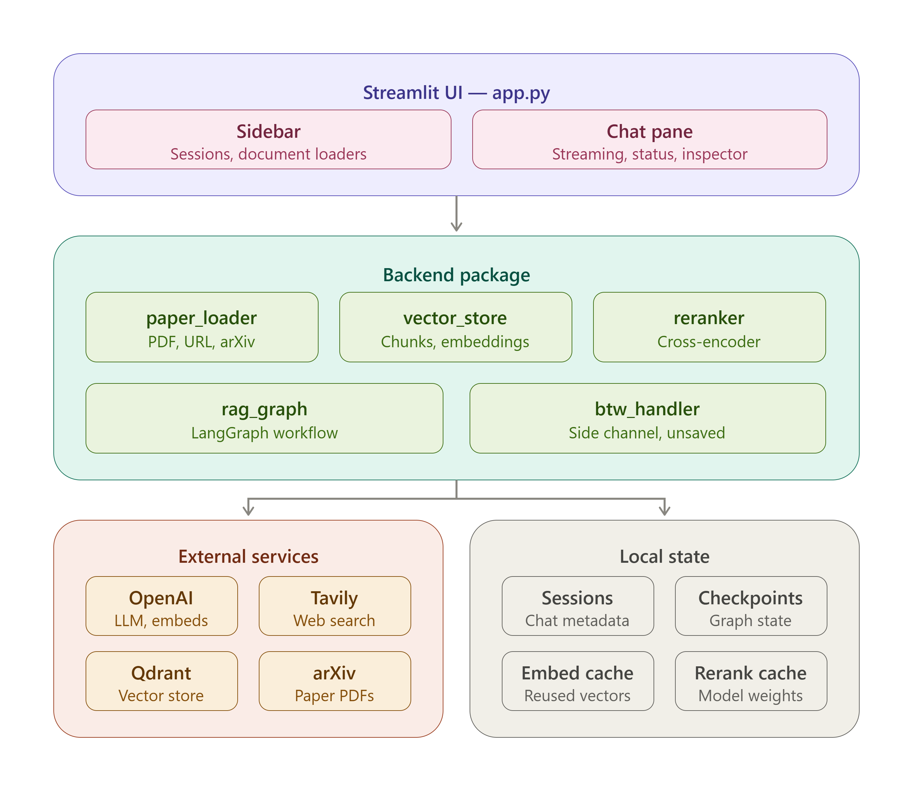
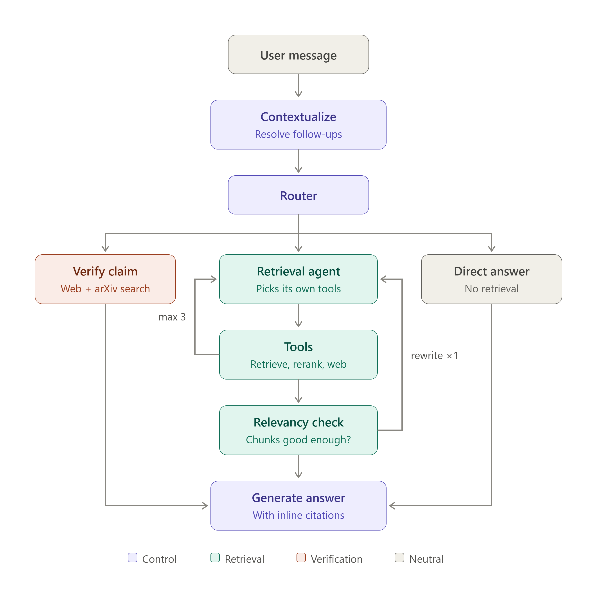
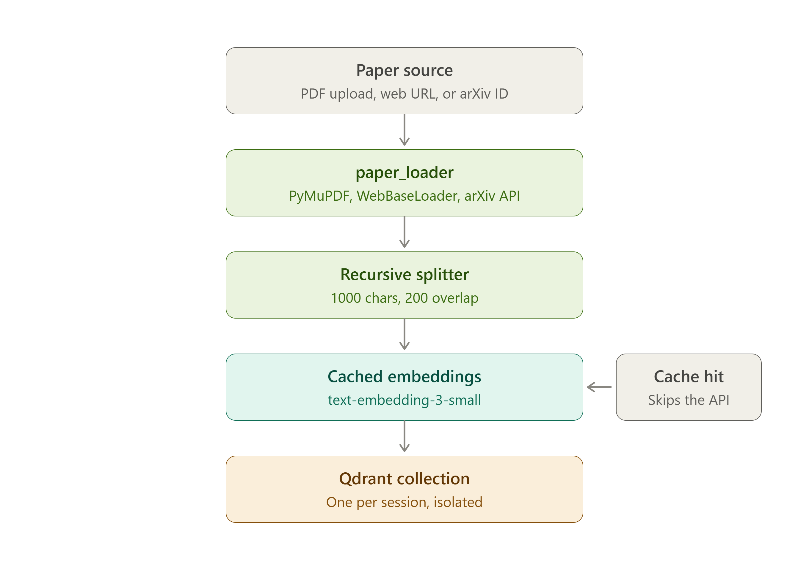

# Papeer — Research Paper Assistant

A conversational AI assistant for students and researchers to upload, explore, and verify academic papers through natural language chat.

---

## Project Description

Papeer is a Retrieval-Augmented Generation (RAG) application built with LangGraph, LangChain, and Streamlit. Users upload research papers (PDF, TXT, Markdown, web URL, or ArXiv ID) into isolated sessions, then ask questions about them. The system routes each query intelligently — answering directly from paper content, searching the web for current developments, or verifying whether a claim from a paper has been superseded by newer research.

---

## Target Users

- **Students** reading and trying to understand dense academic papers
- **Researchers** who want to quickly cross-reference claims across multiple papers
- **Literature reviewers** checking whether findings or methods from older papers still hold today
- **Anyone** who wants a conversational interface to a set of documents without manual reading

---

## Features

| Feature | Description |
|---|---|
| **Paper Q&A** | Ask questions about uploaded papers; the system retrieves relevant chunks and generates grounded answers |
| **Inline Citations** | Every claim carries a bracketed `[n]` marker resolving to a numbered **Sources** list with paper titles and page numbers. Retrieved-but-uncited sources are pruned and the remainder renumbered, so the list reflects what the answer actually used |
| **Cross-Encoder Reranking** | Vector search overfetches candidates and a local FlashRank cross-encoder reorders them before they reach the LLM — recall from the bi-encoder, precision from the cross-encoder |
| **Live Pipeline Progress** | Each stage of the graph run (routing, searching, relevancy check, query rewrite, writing) is reported in real time in a collapsible status panel, then collapses on completion |
| **Follow-up Awareness** | Elliptical replies ("yes please", "tell me more", "what about his other work?") are resolved into standalone questions against the conversation before routing or retrieval, so the assistant carries out what it just offered instead of asking you to restate |
| **Claim Verification** | Ask the assistant to verify a claim — it searches the web and ArXiv to determine if the claim is current or superseded, and returns links to newer papers if applicable |
| **Web Search** | For questions about current developments or explicit search requests, live Tavily results are incorporated |
| **Direct Answers** | General knowledge questions are answered without retrieval or web calls |
| **`/btw` Command** | A side-channel for off-topic questions outside the session context. The LLM decides to answer directly or search the web. These exchanges are **not stored in session history** |
| **Multi-session UI** | Open multiple independent sessions simultaneously, each with its own paper collection and conversation history |
| **Auto Session Naming** | Session titles are automatically generated (3–5 words) from the first message using the LLM |
| **Multiple Paper Sources** | Load papers via file upload (PDF, TXT, MD), web URL, or ArXiv ID/title search |
| **Retrieved Context Pane** | A side panel lists the exact passages behind the latest answer, each with its source title and page number, so you can check the grounding without leaving the chat |
| **Route Badge** | Each answer is labelled with the path that produced it — from your documents, claim-checked, or general knowledge — so the shape of a response is never a surprise |
| **Developer Mode** | A sidebar toggle reveals the raw LangGraph state and reranker scores. Off by default, keeping the reading experience clean for non-technical users |
| **Graph State Inspector** | Under Developer Mode, each assistant turn exposes an expandable JSON view of the LangGraph state for debugging |
| **Streaming Responses** | Assistant responses stream token-by-token with a cursor animation, and a Stop control interrupts a run in progress |
| **Copy to Clipboard** | Every answer can be expanded into a plain-text block with a one-click copy control |

---

## How to Use

### 1. Start a session
Launch the app and a default session is created automatically. Use **New Chat** in the sidebar to start additional sessions.

### 2. Upload papers
In the sidebar, choose one of three loading methods:
- **File Upload** — drag and drop a PDF, TXT, or MD file
- **Web URL** — paste one or more URLs (one per line)
- **ArXiv** — enter a paper title or ArXiv ID (e.g. `2303.08774`)

Loaded papers are listed under "Loaded Papers" in the sidebar.

### 3. Ask questions
Type in the chat input. Example queries:
- *"What methodology does the paper use for evaluation?"*
- *"Verify the claim that encoder-decoder models are the best approach for translation."*
- *"What are the latest developments in diffusion models?"*

### 4. Use `/btw` for off-topic questions
Prefix any message with `/btw` to ask a question outside the current paper context. These exchanges are not saved to the session:
```
/btw What is the difference between RLHF and DPO?
```

---

## Installation

Papeer uses [uv](https://github.com/astral-sh/uv) for dependency management.

```bash
# Clone the repository
git clone <repo-url>
cd rag-papeer-project

# Install all dependencies
uv sync

# Copy the example env file and fill in your keys
cp .env.example .env

# Run the Streamlit app
uv run streamlit run app.py
```

To add a new dependency:
```bash
uv add <package-name>
```

To run a backend module directly (useful during development):
```bash
uv run python -m backend.<module_name>
```

---

## Required API Keys

All keys are loaded from a `.env` file in the project root via `python-dotenv`.

| Variable | Purpose | Where to Get It |
|---|---|---|
| `OPENAI_API_KEY` | LLM inference (`gpt-5-mini`) and embeddings (`text-embedding-3-small`) | [platform.openai.com](https://platform.openai.com) |
| `TAVILY_API_KEY` | Web search for current developments and claim verification | [tavily.com](https://tavily.com) |
| `QDRANT_URL` | Qdrant Cloud endpoint for the vector store | [cloud.qdrant.io](https://cloud.qdrant.io) |
| `QDRANT_API_KEY` | Authentication for Qdrant Cloud | [cloud.qdrant.io](https://cloud.qdrant.io) |

`.env` file format:
```env
OPENAI_API_KEY=sk-...
TAVILY_API_KEY=tvly-...
QDRANT_URL=https://your-cluster.qdrant.io
QDRANT_API_KEY=your-qdrant-api-key
```

### Optional Tuning Variables

All have working defaults; set them only to override.

| Variable | Default | Purpose |
|---|---|---|
| `RERANK_ENABLED` | `true` | Set to `false` to bypass the cross-encoder entirely and fall back to raw similarity order |
| `RERANK_MODEL` | `ms-marco-MiniLM-L-12-v2` | FlashRank model. `ms-marco-TinyBERT-L-2-v2` is ~4 MB and faster but less accurate |
| `RERANK_CACHE_DIR` | `./rerank_cache` | Where model weights are cached (set to `/app/rerank_cache` in the Docker image) |
| `RERANK_OVERFETCH` | `5` | Candidates fetched per final chunk — requesting `k=4` pulls 20 and reranks down to 4 |
| `RERANK_OVERFETCH_MAX` | `40` | Hard ceiling on the candidate pool regardless of `k` |

---

## Architecture



Four layers. The Streamlit UI owns session and document management, the backend package holds all the logic,
external services are the only network dependencies, and local state is what survives a restart.

| Module | Responsibility |
|---|---|
| `backend/rag_graph.py` | LangGraph workflow — contextualize → router → retrieve / verify / direct → answer |
| `backend/reranker.py` | Local cross-encoder reranking, falling back to similarity order on failure |
| `backend/vector_store.py` | Session-scoped Qdrant collections behind a cached embedder |
| `backend/paper_loader.py` | Multi-source loader — PDF, TXT, MD, web URL, ArXiv |
| `backend/btw_handler.py` | `/btw` side channel — streams, touches neither the store nor the checkpointer |
| `backend/models.py` | Pydantic schemas for routing and structured LLM output |

### Query Flow

Every message enters the graph here. The router picks one of three paths and all three converge on a single
answer-generation node.



Two loops carry most of the retrieval quality, and both are deliberately bounded:

- **Agent ⇄ tools** repeats while the agent still wants context, capped at 3 calls. At the cap the agent is
  swapped to an *unbound* LLM rather than merely routed away — leaving the loop while an `AIMessage` still
  carries unmatched `tool_calls` would put orphaned IDs in the checkpointer and corrupt history for every
  later turn in that session.
- **Relevancy → rewrite → agent** fires at most once. If two retrieval passes both miss, a third rarely
  rescues it, and answering honestly beats burning tokens.

`/btw` appears nowhere on this diagram by design — it bypasses the graph entirely.

### Document Ingestion

This runs once when a paper is added, not per query.



The cache sits between the splitter and OpenAI, so re-uploading a paper — or loading one that shares text
with a document already in the store — costs nothing in embedding calls.

---

## How the Project Is Production Optimized

| Optimization | Details |
|---|---|
| **Multi-turn context** | The router, retrieval agent, and answer generator all operate on a conversation-resolved question rather than the raw last message. A `contextualize` node runs first and is skipped entirely on the first turn of a session, so the extra LLM call is only paid when there is history to resolve against |
| **Scratchpad / transcript separation** | `conversation_history()` strips tool-call messages, tool results, and synthetic rewrite queries out of `state["messages"]` before any prompt sees it. Replaying tool traffic wastes tokens; replaying rewrites makes the model believe the user asked something they never asked |
| **History window** | Prompts carry the last 10 real turns with each entry truncated for the contextualizer, bounding token growth on long sessions |
| **Cross-encoder reranking** | Similarity search overfetches (5× the requested `k`, capped at 40) and a local FlashRank cross-encoder reorders the pool before the top `k` reach the LLM. Bi-encoders optimise recall, not precision — they put the right passage in the top 20 but rarely the top 4 — and this closes that gap without an extra API dependency |
| **Contextualizer fails open** | If the follow-up rewrite errors, the raw message is used unchanged. A resolution failure degrades the answer; it must never block the turn |
| **Reranker degrades gracefully** | If the model is missing or inference throws, the failure is logged and retrieval falls back to similarity order. Reranking is an optimisation, never a hard dependency |
| **Reranker baked into the image** | The Dockerfile pre-downloads the model at build time, so a cold container doesn't stall on the first user query |
| **Citation pruning** | Sources the model didn't cite are dropped and the rest renumbered from 1 in a single regex pass, so a swap (3→1, 1→2) can't double-map. Listing unused sources makes an answer look less grounded than it is |
| **Error boundary on the graph run** | Any exception during streaming is caught, surfaced in the status panel, and rendered as a readable message rather than a Streamlit traceback — the session stays usable |
| **Deferred chat commit** | The user message and the answer are appended to the chat log together, only once a turn finishes. Interrupting a run therefore leaves no dangling user bubble with no reply — the turn simply disappears |
| **Idempotent uploads** | Files are ingested the moment they are selected, guarded by a per-session set of processed filenames, so the reruns Streamlit fires on every widget interaction cannot re-embed the same document |
| **Context pane reads the checkpointer** | The retrieved-passages panel is rebuilt from graph state rather than in-memory chat, so it survives a session switch or an app restart |
| **Embedding cache** | `CacheBackedEmbeddings` writes to `./embedding_cache/` so identical text is never re-embedded across sessions — reduces OpenAI API calls and latency |
| **Session isolation** | Each session gets its own Qdrant collection (`papeer_{session_id}`) and a separate LangGraph SQLite checkpointer thread — prevents cross-session data leakage |
| **Graph caching** | The LangGraph graph is built once with `@st.cache_resource` and reused across all Streamlit reruns |
| **Streaming responses** | `graph.stream()` runs in combined `updates` + `messages` mode: `messages` drives token-by-token output, `updates` reports node transitions (including the tool node, which makes no LLM call and is therefore invisible to `messages` mode) |
| **Canonical answer from state** | The rendered answer is read back from graph state rather than the accumulated token stream, because the Sources block is appended after generation and never crosses the stream. This also fixes `verify_claim`, which builds its output as a plain string with no LLM call |
| **Session persistence** | `sessions.json` persists session metadata; SQLite stores full conversation state — app restarts restore the previous session seamlessly |
| **Temp file cleanup** | Uploaded files are written to a temp path, processed, then deleted regardless of success or failure |
| **Async evaluation** | The evaluation pipeline uses throttled concurrency (3 workers, 5 s throttle) to stay within API rate limits |
| **ArXiv reliability** | Claim verification uses two targeted Tavily searches (general web + `site:arxiv.org`) instead of the `arxiv` Python library, which had reliability issues |

---

## Constraints and Why

| Constraint | Why |
|---|---|
| **Max 3 retrieval tool calls** | The agent may call `retrieve_from_vectorstore` or `web_search` at most 3 times per turn before it is forced onto a plain LLM. Without this cap, ambiguous queries would loop indefinitely, burning tokens and blocking the user. At the cap the agent is swapped to an unbound LLM so it *cannot* emit further tool calls — an orphaned `tool_call` ID in the checkpointer would corrupt history for every later turn in that session |
| **Max 1 query rewrite** | If the relevancy check rejects the retrieved chunks, the query is rewritten and retried exactly once, then the graph answers with what it has. A second rewrite empirically rarely recovers a query that two retrievals have already missed |
| **Overfetch 5×, capped at 40** | Larger candidate pools give the cross-encoder more to work with but cost Qdrant latency and embedding-cache misses. 5× keeps a `k=4` request at 20 candidates — well inside FlashRank's fast path |
| **Chunk size 1000 / overlap 200** | Balances retrieval precision (smaller = more focused) against context preservation across chunk boundaries. The 200-char overlap ensures sentences split across chunks are still retrievable |
| **Tavily max 3 results for `/btw`** | Keeps the context window manageable for side-channel queries that are intentionally lightweight and unsaved |
| **`/btw` exchanges not stored** | These are deliberately out-of-context questions. Storing them would pollute session history and confuse the LLM's understanding of the paper-focused conversation |
| **Session-scoped Qdrant collections** | Prevents papers from one session leaking into another. Each collection is namespaced by session UUID |
| **Claim verification uses two searches** | A general web search catches blog posts and news; an `arxiv.org`-targeted search catches academic superseding work. One search alone misses one of these two important source types |
| **`k=4` default retrieval chunks** | Balances context richness against prompt length. Too few chunks miss relevant content; too many dilute focus and increase cost. With reranking this is 4 *survivors* of a 20-candidate pool rather than 4 raw similarity hits |

---

## Evaluation

Papeer includes an automated RAG evaluation pipeline (`evaluate.py`) built on [DeepEval](https://github.com/confident-ai/deepeval).

### Metrics (threshold: 0.7)

| Metric | What It Measures |
|---|---|
| **Contextual Precision** | Are the retrieved chunks relevant to the query? |
| **Contextual Recall** | Does the retrieved context cover all expected information? |
| **Contextual Relevancy** | Is the context relevant to both the input and the expected output? |
| **Answer Relevancy** | Does the generated answer actually address the question? |
| **Faithfulness** | Is the answer grounded in the retrieved context (no hallucination)? |

### Running Evaluation

```bash
uv run python evaluate.py
```

- On first run, synthetic golden test cases are generated from `documents/Openclaw_Research_Report.pdf` and cached to `goldens.json`
- Results are written to `eval_results.json` with per-test metric scores, pass/fail status, and failure reasons
- Subsequent runs reuse cached goldens unless `goldens.json` is deleted

> **Note on current scores:** the checked-in `eval_results.json` predates reranking. It shows the classic
> bi-encoder signature — Contextual Recall at 1.00 with Contextual Relevancy at 0.09–0.27, i.e. the right
> passage was retrieved and then buried among irrelevant ones. Delete `eval_results.json` and re-run to
> measure the reranked pipeline.

---

## Changelog

### Multi-turn conversation

- **`contextualize` node** at the graph entry point rewrites elliptical follow-ups into standalone
  questions before routing. Previously `router_node` classified `state["messages"][-1]` in isolation and
  every branch of `generate_answer_node` built its prompt from `query` alone, so “Yes, please.” reached
  the model with no idea what it was agreeing to.
- **`conversation_history()` / `prior_turns()`** extract the durable user→assistant transcript from
  `state["messages"]`, excluding tool-call messages, tool results, and synthetic rewrite queries. Used by
  the contextualizer, the answer generator, and session replay.
- **Rewrites are tagged.** `query_rewrite_node` marks its injected `HumanMessage` with a
  `papeer_synthetic` flag so machine-generated search queries are never replayed as user turns.
- **`user_question` in state** preserves what the user actually asked. `query` may be overwritten by a
  retrieval rewrite, and the final answer was previously generated against that machine query rather than
  the real question.
- **`agent_node` and `verify_claim_node`** now read the resolved question instead of the literal last
  message.
- **Session replay fixed.** `load_session_chats` reused the same transcript filter, so reloading a
  session that used tools no longer renders empty assistant bubbles or inflates the turn counter.

### Retrieval quality and answer attribution

- **Inline citations.** `generate_answer_node` now builds a numbered context block via
  `build_cited_context()` and instructs the model to cite each claim. Chunks are grouped by source, so
  four chunks from one page collapse to a single `[1]` rather than `[1][2][3][4]`. Page numbers are
  converted from PyMuPDF's 0-indexed metadata for display.
- **Citation pruning.** `prune_citations()` removes sources the model didn't reference and renumbers the
  survivors from 1.
- **Cross-encoder reranking.** New `backend/reranker.py`. `retrieve_from_vectorstore` overfetches via
  `candidate_pool_size()` and trims with `rerank()`. Falls back to similarity order on any failure.
  `rerank_score` is attached to chunk metadata and visible in the graph-state inspector.

### UI

- **Wide layout with a retrieved-context pane.** The main area is now a 2:1 split — chat on the left,
  the passages behind the latest answer on the right, each with source title and page number. The pane
  reads from the checkpointer, so it survives session switches and restarts.
- **Route badge** under every answer, naming the path that produced it.
- **Developer mode toggle.** The graph-state JSON and reranker scores are now behind a sidebar switch,
  off by default. A raw state dump under every message is useful during development and confusing for a
  reader.
- **Sidebar restructured.** Upload / URL / ArXiv moved into tabs; uploads ingest on selection with a
  progress bar rather than requiring a second click on an “Add Files” button.
- **Copy control** on each answer, and an empty-state card that adapts to whether any documents are loaded.
- **Stop button** during generation. Clicking it interrupts the script run; since the chat log is only
  committed once a turn completes, the interrupted turn leaves no half-finished exchange behind.
- **Theme.** Added `.streamlit/config.toml` (dark base, teal accent) and copied it into the Docker image.

### Live pipeline progress

- **Live pipeline progress.** The graph run streams in combined `updates` + `messages` mode and reports
  each stage into an `st.status` panel, which collapses to “Done” on completion. When the agent queues a
  tool call the label names the tool (“Searching your papers…”) rather than the node, so the label appears
  *while* the search runs instead of after it.
- **Error boundary.** Exceptions during the graph run are caught and shown in the status panel instead of
  crashing the page with a traceback.

### Build and dependencies

- Added `flashrank`; removed `chromadb` (superseded by Qdrant) and `arxiv` (superseded by direct Tavily +
  urllib calls) — both were declared but unimported.
- Dockerfile pre-downloads the reranker model, adds a `HEALTHCHECK` against `/_stcore/health`, and no
  longer copies `main.py` (an unused scaffold stub) or `sessions.json` (runtime state that shouldn't be
  baked into an image).

### Documentation

- Added `architecture_diagrams/` with three rendered diagrams — system layers, query flow, and ingestion
  pipeline — and replaced the ASCII blocks in this README with them. The module tree became a table.
- Corrected the query-rewrite constraint: the code permits **one** rewrite, not three. The three-attempt
  cap applies to retrieval tool calls, which is a separate mechanism.
